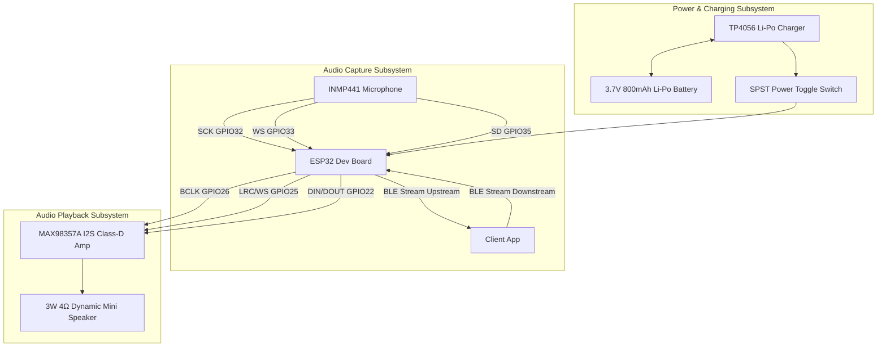
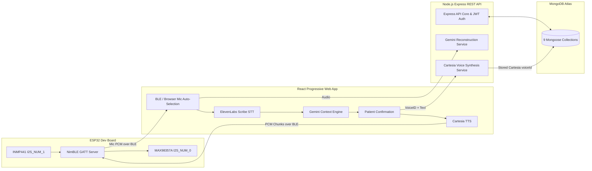

# VoiceBack – Comprehensive Project Context & Specifications

> **Document Status:** Active Technical Reference (Aligned with Canonical Architecture)  
> **Source of Truth:** [VOICEBACK_FINAL_ARCHITECTURE_SPEC.md](VOICEBACK_FINAL_ARCHITECTURE_SPEC.md) | [VOICEBACK_END_TO_END_WORKFLOW.md](VOICEBACK_END_TO_END_WORKFLOW.md)
> **Target Audience:** Developers, Clinical Researchers, Hardware Engineers, Speech Pathologists  

---

## 1. Domain Background & Problem Statement

**Aphasia** is a neuro-cognitive language disorder resulting from damage to speech and language centers in the brain (most frequently induced by stroke, traumatic brain injury, or neurological lesions). Individuals with aphasia often experience severe difficulty in motor articulation, verbal expression, or word retrieval, even though cognitive intent and contextual awareness remain largely intact. Speech output is frequently characterized as weak, whispered, dysarthric, or fragmented.

**VoiceBack** bridges this communication barrier through an integrated wearable and mobile ecosystem:
1. **Primary Speech Capture:** Captures patient vocalizations seamlessly using the **INMP441 Physical Microphone** over BLE, or automatically falls back to the browser microphone if disconnected.
2. **Speech-to-Text Layer:** Transcribes acoustic signals into text via **ElevenLabs Scribe**.
3. **Speech Cleanup & Meaning Reconstruction:** If speech is dysarthric, broken, or unclear, the system leverages Gemini LLM to reconstruct the most likely intended meaning. Clear speech is preserved without unnecessary modification.
4. **Context & Intent Understanding:** Leverages a dynamic Context Engine (Gemini LLM) to generate contextually relevant conversational responses for Companion Mode questions.
5. **Patient Agency:** Presents the reconstructed intent or dynamic response choices; the patient selects and explicitly confirms their intended answer. Cancel prevents TTS.
6. **Voice Synthesis & Output:** Synthesizes speech using the patient's enrolled **Cartesia** voice clone (supporting dynamic emotions). Audio is transferred via Web Bluetooth Low Energy (BLE) to an ESP32 wearable neckband speaker for physical playback.

---

## 2. Hardware Architecture & Wiring Matrix

The wearable component is an ergonomic neckband built from accessible, high-performance embedded prototype modules. The system features a dual-I2S architecture to safely isolate the microphone and speaker pathways.

### Complete Hardware Wiring Table (Compiled Firmware Baseline)

| Hardware Module | Module Pin | ESP32 GPIO Pin | Function |
| :--- | :--- | :--- | :--- |
| **INMP441 Microphone** | `SCK` | `GPIO32` | I2S_NUM_1 Clock |
| | `WS` | `GPIO33` | I2S_NUM_1 Word Select |
| | `SD` | `GPIO35` | I2S_NUM_1 Serial Data IN |
| | `VCC` | `3.3V` | System positive 3.3V power rail |
| | `GND` | `GND` | Common system ground rail |
| | `L/R` | `GND` | Left Channel select |
| **MAX98357A I2S Amp** | `BCLK` | `GPIO26` | I2S_NUM_0 Bit Clock |
| | `LRC` / `WS` | `GPIO25` | I2S_NUM_0 Left/Right Word Select Clock |
| | `DIN` / `DOUT` | `GPIO22` | I2S_NUM_0 Serial PCM Audio Data line |
| | `GAIN` | `GND` / `3.3V` | Hardware gain configuration (GND = 12dB, 3.3V = 6dB) |
| | `VIN` | `3.3V` / `5V` | Amplifier positive power supply rail |
| | `GND` | `GND` | Common system ground rail |
| **TP4056 PMIC** | `BAT+` / `BAT-` | Battery Terminals | 3.7V 800mAh Li-Po Cell Connection |
| | `OUT+` | Power Switch -> `VIN` | Switched battery positive rail |
| | `OUT-` | `GND` | Common system ground rail |
| **Mini Speaker** | `+` / `-` | MAX98357A OUT | Differential audio output driving 4Ω 3W dynamic speaker |

> **IMPORTANT:** BioAmp EXG and EMG telemetry are permanently removed from the VoiceBack architecture. GPIO34 is completely unused.

---

## 3. Firmware Architecture (ESP32 C++ PlatformIO)

Located in `firmware/`, the firmware is organized into modular subsystems:

- **Configuration Module (`include/config.h`)**: Defines pin mappings for the dual I2S pathways (Speaker on `I2S_NUM_0`, Mic on `I2S_NUM_1`) and BLE GATT UUIDs.
- **Microphone Driver (`src/mic_driver.cpp`)**: Manages I2S_NUM_1 capture from the INMP441.
- **BLE GATT Server (`src/ble_service.cpp`)**: Implements NimBLE GATT Server under device name `VoiceBack-Neckband`. Streams INMP441 audio upstream to the PWA and receives 16kHz PCM audio packets downstream for playback.
- **Audio DAC Driver (`src/audio_driver.cpp`)**: Configures hardware I2S DMA on `GPIO26`, `GPIO25`, and `GPIO22` for 16kHz 16-bit mono PCM playback.

---

## 4. Software Architecture & Ecosystem

### Backend Services & Authentication Architecture (`backend/src/`)
- **Express Core**: CORS protection, structured logging, and centralized error handling.
- **Authentication & RBAC**: Passwords hashed with `bcrypt`, JWT session tokens enforcing role isolation (Patient, Doctor, Caregiver).
- **Context Engine**: Interfaces with Gemini LLM to reconstruct unclear speech (preserving clear speech) and generates ephemeral response options for unseen Companion Mode questions.
- **Voice Synthesis**: Uses **Cartesia** to generate high-fidelity cloned speech using the patient's securely stored `voiceId`. Supports context-aware emotion rendering when applicable.

---

## 5. Database Schema Architecture (MongoDB Atlas)

The database utilizes Mongoose Collections structured in `backend/src/models/`:

1. `UserLogin`: Credentials, role (`Patient`, `Doctor`, `Caregiver`), password hash.
2. `Patient`: Demographic profile, aphasia type, assigned doctor/caregiver IDs.
3. `Doctor`: Clinical credentials, specialization.
4. `Caregiver`: Contact details, relationship to patient.
5. `VoiceProfile`: Stores the patient's Cartesia `voiceId` and synthesis settings.
6. `TherapyProgress`: Clinical therapy logs.
7. `CommunicationHistory`: Speech recognition event logs.
8. `Appointment`: Doctor-patient session scheduling.
9. `EmergencySOS`: Patient emergency alerts.

---

## 6. Language & Localization

VoiceBack operates natively in the provided language spaces without fabricating additional unsupported language capabilities. 
- Kannada input yields Kannada output.
- English input yields English output.
- Mixed Kannada-English speech correctly retains its natural multilingual meaning.
