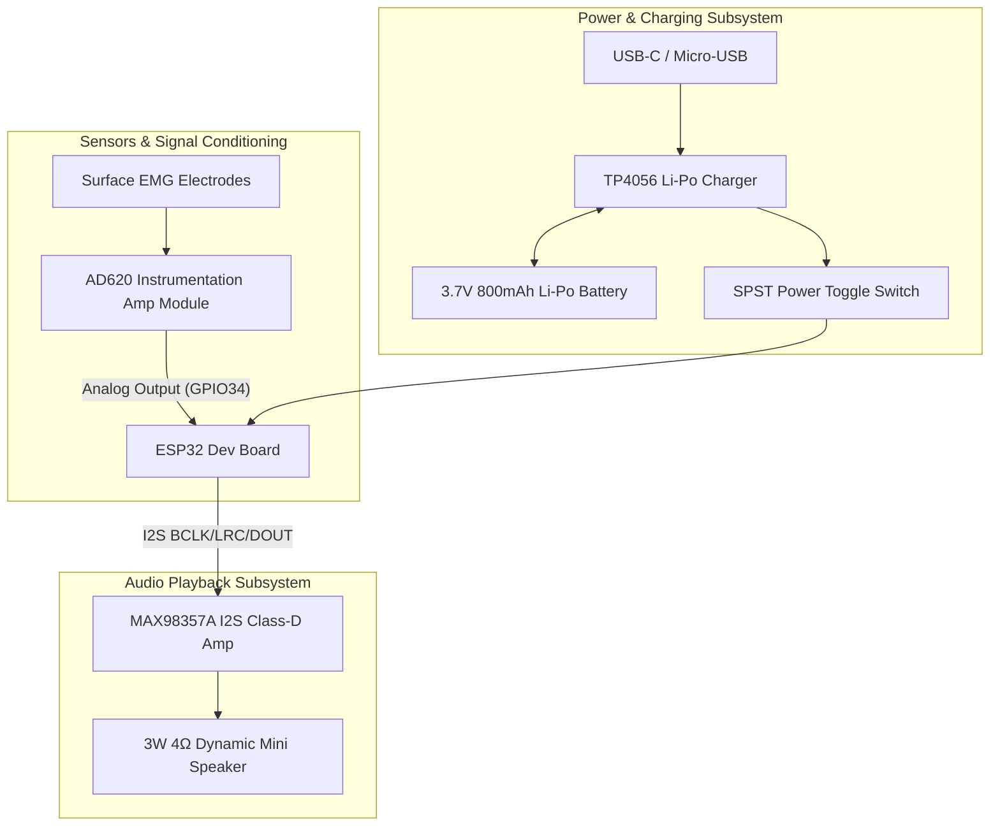
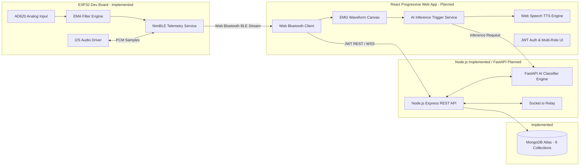
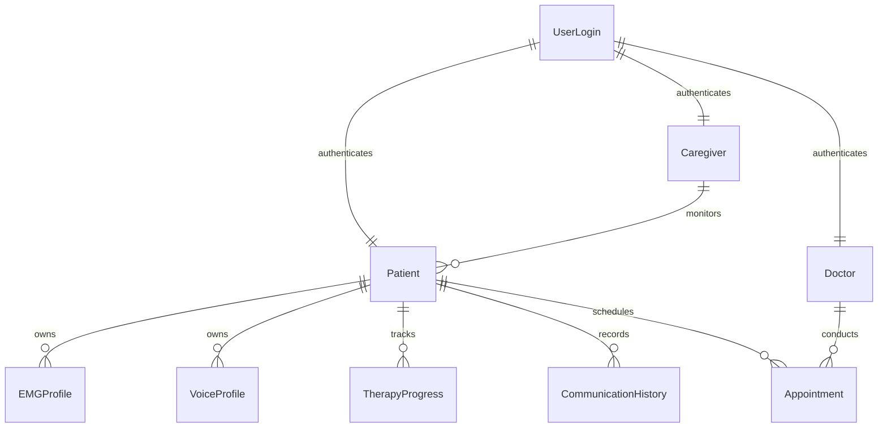

# VoiceBack – Comprehensive Project Context & Specifications

> **Document Status:** Permanent Source of Truth  
> **Last Updated:** 2026-07-31  
> **Target Audience:** Developers, Hardware Engineers, AI Researchers, Speech Pathologists  

---

## 1. Domain Background & Problem Statement

**Aphasia** is a neuro-cognitive language disorder caused by damage to speech centers in the brain (most commonly resulting from strokes, traumatic brain injury, or brain tumors). Patients affected by aphasia frequently experience severe loss or impairment of verbal articulation. However, the neuromuscular intent to speak often persists, causing subtle laryngeal and vocal muscle contractions even when audible speech is weak, whispered, silent, or unintelligible.

**VoiceBack** bridges this communication gap by capturing surface electromyography (**sEMG**) signals from the anterior neck muscles. The system:
1. Detects neuromuscular speech attempts (silent, whispered, weak, unclear).
2. Extracts signal features in real time.
3. Decodes intended speech via an AI classifier engine.
4. Generates synthesized audio locally through a neckband speaker and on an accompanying Progressive Web App (PWA).

---

## 2. Hardware Architecture & Wiring Matrix

The wearable component is an ergonomic neckband built from accessible, high-performance prototype modules.



### Complete Hardware Wiring Table

| Hardware Module | Module Pin | ESP32 GPIO Pin | Function |
| :--- | :--- | :--- | :--- |
| **AD620 EMG Sensor** | `VOUT` (Analog) | `GPIO34` (ADC1_CH6) | Differential analog sEMG voltage input |
| | `VCC` | `3.3V` / `5V` | System power rail |
| | `GND` | `GND` | Common system ground |
| **MAX98357A I2S Amp** | `BCLK` | `GPIO4` | I2S Bit Clock |
| | `LRC` / `WS` | `GPIO5` | Left/Right Word Select Clock |
| | `DIN` / `DOUT` | `GPIO6` | Serial PCM Audio Data Output |
| | `GAIN` | `GND` / `3.3V` | Gain control setting (12dB / 6dB) |
| | `VIN` | `3.3V` / `5V` | Amplifier power supply |
| **TP4056 PMIC** | `BAT+` / `BAT-` | Battery Terminals | 3.7V Li-Po Cell Connection |
| | `OUT+` | Power Switch -> `VIN` | Switched battery rail |

---

## 3. Firmware Architecture (ESP32 C++ - Implemented v0.1)

Located in [firmware/](firmware), the firmware is modularized into discrete drivers:

- **Config Module (`include/config.h`)**: Defines hardware pins, ADC 12-bit parameters, sample rate (50Hz / 20ms interval), EMA smoothing coefficient ($\alpha = 0.15$), and NimBLE GATT UUIDs.
- **EMG Subsystem (`include/emg_sensor.h`, `src/emg_sensor.cpp`)**: Reads raw ADC values from GPIO34 ($0-4095$), applies Exponential Moving Average (EMA) filtering:
  $$S_t = \alpha \cdot X_t + (1 - \alpha) \cdot S_{t-1}$$
  and calculates equivalent analog voltage ($0 - 3.3\text{V}$).
- **BLE Telemetry Engine (`include/ble_service.h`, `src/ble_service.cpp`)**: Implements NimBLE GATT Server under device name `VoiceBack-Neckband`. Packets stream JSON telemetry:
  ```json
  { "raw": 1842, "flt": 1835.45, "vlt": 1.479 }
  ```
- **Audio DAC Driver (`include/audio_driver.h`, `src/audio_driver.cpp`)**: Driver for MAX98357A via ESP32 I2S peripherals (`I2S_NUM_0`, 16kHz 16-bit mono PCM), including a 440Hz test sine-wave generator.

---

## 4. Software Architecture & Ecosystem (Backend Implemented v0.2)



### Backend REST API & Authentication Architecture (`backend/src/`)
- **Express App Setup (`app.js`)**: CORS middleware configured via `CLIENT_ORIGIN`, JSON body parsing, HTTP logging (`logger.js`), and centralized error handling (`errorHandler.js`).
- **User Authentication (`userLoginService.js`, `userLoginController.js`)**:
  - Passwords hashed using `bcrypt` with 10 salt rounds upon creation.
  - Password hashes automatically excluded from queries (`.select('-passwordHash')`).
  - JWT Authentication endpoint `POST /api/user-logins/login` validates credentials and issues a signed JWT token valid for 7 days (`expiresIn: "7d"`).
- **Environment Configuration (`.env`)**: Manages `PORT=5000`, `NODE_ENV`, `MONGODB_URI` (MongoDB Atlas), `JWT_SECRET`, and `CLIENT_ORIGIN`.

---

## 5. AI Module & Signal Processing Pipeline

1. **EMG Acquisition & Filtering (Implemented)**:
   - Sampling rate: 50 Hz (20ms interval).
   - Smoothing: Exponential Moving Average (EMA, $\alpha = 0.15$).
2. **Windowing & Feature Extraction (Planned)**:
   - Window size: 200 ms sliding window with 50 ms overlap.
   - Feature vector: Mean Absolute Value (MAV), Root Mean Square (RMS), Zero Crossing Rate (ZCR), and Waveform Length (WL).
3. **Speech Attempt Classification (Planned)**:
   - Model: Lightweight Random Forest / CNN classifier running inside `ai_engine/` (FastAPI).
   - Categorization: Silent Speech, Whispered Speech, Weak Speech, Unclear Speech.
4. **Speech Output Generation**:
   - Text-to-Speech engine triggers audio playback via Mobile App and streams PCM back to ESP32 MAX98357A neckband speaker.

---

## 6. Database Schema Architecture (MongoDB Atlas - Implemented)

The system utilizes **9 MongoDB Collections** designed for clinical and assistive tracking:



### Collection Specifications & REST Endpoints:
1. `UserLogin`: Credentials, role (`Patient` | `Doctor` | `Caregiver`), password hash, last login.
   - Endpoints: `GET /api/user-logins`, `GET /api/user-logins/:id`, `POST /api/user-logins`, `POST /api/user-logins/login`, `PUT /api/user-logins/:id`, `DELETE /api/user-logins/:id`
2. `Patient`: Clinical profile, age, aphasia type classification, assigned doctor ID, assigned caregiver ID.
   - Endpoints: `GET /api/patients`, `GET /api/patients/:id`, `POST /api/patients`, `PUT /api/patients/:id`, `DELETE /api/patients/:id`
3. `Doctor`: Medical credentials, specialization, hospital affiliation.
   - Endpoints: `GET /api/doctors`, `GET /api/doctors/:id`, `POST /api/doctors`, `PUT /api/doctors/:id`, `DELETE /api/doctors/:id`
4. `Caregiver`: Contact details, relationship to patient, assigned patient list.
   - Endpoints: `GET /api/caregivers`, `GET /api/caregivers/:id`, `POST /api/caregivers`, `PUT /api/caregivers/:id`, `DELETE /api/caregivers/:id`
5. `VoiceProfile`: Pitch preference, speed rate, custom synthesized voice asset URL.
   - Endpoints: `GET /api/voice-profiles`, `GET /api/voice-profiles/:id`, `POST /api/voice-profiles`, `PUT /api/voice-profiles/:id`, `DELETE /api/voice-profiles/:id`
6. `EMGProfile`: Baseline sEMG thresholds, Max Voluntary Contraction (MVC) values, calibrated signature vectors.
   - Endpoints: `GET /api/emg-profiles`, `GET /api/emg-profiles/:id`, `POST /api/emg-profiles`, `PUT /api/emg-profiles/:id`, `DELETE /api/emg-profiles/:id`
7. `TherapyProgress`: Session logs, completed exercise counts, accuracy scores over time.
   - Endpoints: `GET /api/therapy-progress`, `GET /api/therapy-progress/:id`, `POST /api/therapy-progress`, `PUT /api/therapy-progress/:id`, `DELETE /api/therapy-progress/:id`
8. `CommunicationHistory`: Real-time speech recognition log (timestamp, attempt type, recognized text, confidence score).
   - Endpoints: `GET /api/communication-history`, `GET /api/communication-history/:id`, `POST /api/communication-history`, `PUT /api/communication-history/:id`, `DELETE /api/communication-history/:id`
9. `Appointment`: Scheduling system (patient ID, doctor ID, date, status, clinical notes).
   - Endpoints: `GET /api/appointments`, `GET /api/appointments/:id`, `POST /api/appointments`, `PUT /api/appointments/:id`, `DELETE /api/appointments/:id`

---

## 7. Multi-Computer Strategy & Parity Principles

Because development alternates between a **College PC** and a **Home PC**:
- **No Invisible State**: Decisions made in chat or memory must be immediately persisted to repository files.
- **Git Parity**: Every session starts with `git pull` and ends with committed, pushed changes accompanied by updated documentation.
- **Standardized Environments**: Both machines run VS Code, PlatformIO IDE, Node.js 18+, Python 3.10, and Git.

