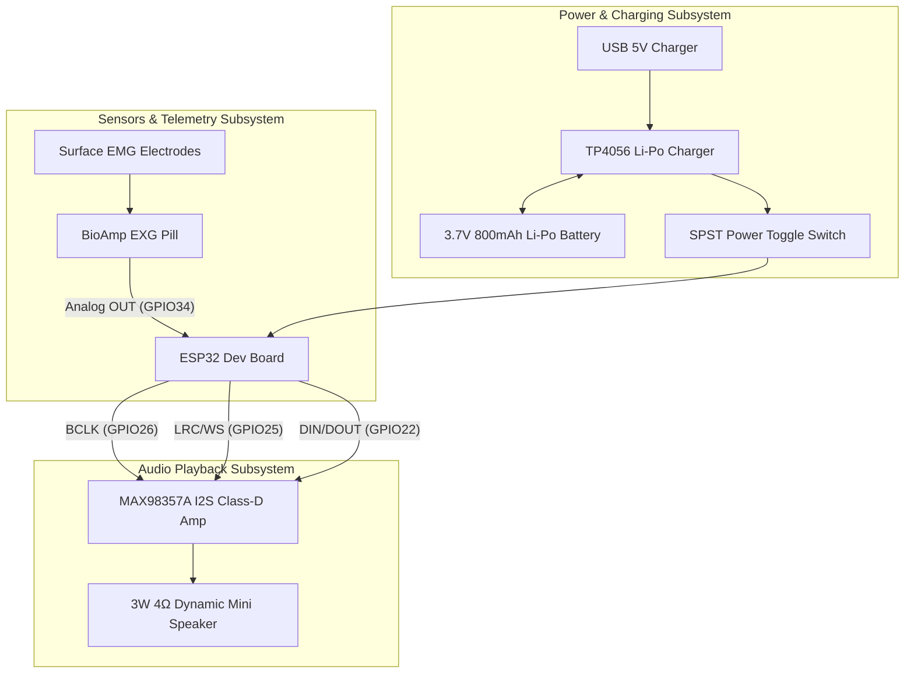

# VoiceBack – Comprehensive Project Context & Specifications

> **Document Status:** Active Technical Reference (Aligned with Canonical Architecture)  
> **Source of Truth:** [VOICEBACK_FINAL_PRD.md](VOICEBACK_FINAL_PRD.md) (Version 1.0) | [VOICEBACK_FINAL_ARCHITECTURE_SPEC.md](VOICEBACK_FINAL_ARCHITECTURE_SPEC.md) | [VOICEBACK_END_TO_END_WORKFLOW.md](VOICEBACK_END_TO_END_WORKFLOW.md) | [firmware/README.md](firmware/README.md) | [docs/DATABASE.md](docs/DATABASE.md)  
> **Target Audience:** Developers, Clinical Researchers, Hardware Engineers, Speech Pathologists  

---

## 1. Domain Background & Problem Statement

**Aphasia** is a neuro-cognitive language disorder resulting from damage to speech and language centers in the brain (most frequently induced by stroke, traumatic brain injury, or neurological lesions). Individuals with aphasia often experience severe difficulty in motor articulation, verbal expression, or word retrieval, even though cognitive intent and contextual awareness remain largely intact. Speech output is frequently characterized as weak, whispered, dysarthric, or fragmented.

**VoiceBack** bridges this communication barrier through an integrated wearable and mobile ecosystem:
1. **Primary Speech Capture:** Captures patient vocalizations directly using a **Physical Microphone** as the primary speech input.
2. **Speech-to-Text Layer:** Transcribes raw acoustic signals via **Wispr Flow** (or approved cloud STT provider).
3. **Speech Cleanup & Meaning Reconstruction:** Normalizes dysarthric and noisy transcripts into clear semantic intent.
4. **Context & Intent Understanding:** Leverages a dynamic Context Engine (Gemini LLM) to generate contextually relevant conversational responses based on caregiver prompts and patient history.
5. **Patient Agency:** Presents ephemeral dynamic response choices; the patient selects and explicitly confirms their intended answer.
6. **Voice Synthesis & Output:** Synthesizes speech using the patient's enrolled ElevenLabs voice clone (`eleven_v3`), transferring audio via Web Bluetooth Low Energy (BLE) to an ESP32 wearable neckband speaker for physical playback.
7. **Telemetry Tracking:** Monitors muscular effort and electrode impedance using a **BioAmp EXG Pill** strictly for hardware telemetry and baseline calibration.

---

## 2. Hardware Architecture & Wiring Matrix

The wearable component is an ergonomic neckband built from accessible, high-performance embedded prototype modules.



### Complete Hardware Wiring Table (Compiled Firmware Baseline)

| Hardware Module | Module Pin | ESP32 GPIO Pin | Function |
| :--- | :--- | :--- | :--- |
| **BioAmp EXG Pill** | `OUT` (Analog) | `GPIO34` (ADC1_CH6) | sEMG analog voltage input (telemetry & calibration only) |
| | `VCC` | `3.3V` | System positive 3.3V power rail |
| | `GND` | `GND` | Common system ground rail |
| **MAX98357A I2S Amp** | `BCLK` | `GPIO26` | I2S Bit Clock |
| | `LRC` / `WS` | `GPIO25` | I2S Left/Right Word Select Clock |
| | `DIN` / `DOUT` | `GPIO22` | Serial PCM Audio Data line |
| | `GAIN` | `GND` / `3.3V` | Hardware gain configuration (GND = 12dB, 3.3V = 6dB) |
| | `VIN` | `3.3V` / `5V` | Amplifier positive power supply rail |
| | `GND` | `GND` | Common system ground rail |
| **TP4056 PMIC** | `BAT+` / `BAT-` | Battery Terminals | 3.7V 800mAh Li-Po Cell Connection |
| | `OUT+` | Power Switch -> `VIN` | Switched battery positive rail |
| | `OUT-` | `GND` | Common system ground rail |
| **Mini Speaker** | `+` / `-` | MAX98357A OUT | Differential audio output driving 4Ω 3W dynamic speaker |

---

## 3. Firmware Architecture (ESP32 C++ PlatformIO)

Located in [firmware/](firmware), the firmware is organized into modular subsystems:

- **Configuration Module (`include/config.h`)**: Defines pin mappings (`BIOAMP_ANALOG_PIN = 34`, `MAX98357_I2S_BCLK = 26`, `MAX98357_I2S_LRC = 25`, `MAX98357_I2S_DOUT = 22`), ADC parameters (12-bit resolution, 500Hz sampling), EMA smoothing coefficient ($\alpha = 0.15$), and BLE GATT UUIDs.
- **BioAmp Subsystem (`include/emg_sensor.h`, `src/emg_sensor.cpp`)**: Reads raw ADC values from `GPIO34`, executes Exponential Moving Average (EMA) filtering, and scales voltage ($0 - 3.3\text{V}$) for telemetry. *BioAmp is not used for speech recognition.*
- **BLE GATT Server (`include/ble_service.h`, `src/ble_service.cpp`)**: Implements NimBLE GATT Server under device name `VoiceBack-Neckband`. Streams telemetry JSON packets (`beb5483e-36e1-4688-b7f5-ea07361b26a8`) and receives 180-byte 16kHz PCM audio packets (`cba1483e-36e1-4688-b7f5-ea07361b26b9`).
- **Audio DAC Driver (`include/audio_driver.h`, `src/audio_driver.cpp`)**: Configures hardware I2S DMA on GPIO26, GPIO25, and GPIO22 for 16kHz 16-bit mono PCM playback.

---

## 4. Software Architecture & Ecosystem

```mermaid
graph LR
    subgraph Wearable Firmware [ESP32 Dev Board]
        A1[BioAmp Analog Input GPIO34] --> A2[EMA Telemetry Filter]
        A2 --> A3[NimBLE GATT Server]
        A4[MAX98357A I2S DAC GPIO26/25/22] <-- 16kHz PCM -- A3
    end

    subgraph Client Application [React 19 Progressive Web App]
        B1[Microphone Capture] --> B2[Wispr Flow STT Gateway]
        B2 --> B3[Context Engine / Ephemeral Choices]
        B3 --> B4[Patient Selection & Confirmation]
        B4 --> B5[Web Bluetooth GATT Audio Stream]
        B5 -- Chunks to ESP32 --> A3
    end

    subgraph Backend Services [Node.js Express REST API]
        C1[Express API Core & JWT Auth]
        C2[Gemini Context Engine Service]
        C3[ElevenLabs Voice Synthesis Service]
        C4[Emergency SOS Dispatch Service]
    end

    subgraph Database Tier [MongoDB Atlas]
        D1[(10 Mongoose Collections)]
    end

    B1 -- Speech Audio --> C2
    B4 -- Synthesis Request --> C3
    C1 <--> D1
    C3 -- Stored voiceId --> D1
```

### Backend Services & Authentication Architecture (`backend/src/`)
- **Express Core (`app.js`, `server.js`)**: CORS protection, JSON payload parsing, structured logging (`logger.js`), and centralized error handling (`errorHandler.js`).
- **Authentication & RBAC (`userLoginService.js`, `authMiddleware.js`)**: Passwords hashed with `bcrypt` (10 rounds), query password exclusion (`.select('-passwordHash')`), and JWT session tokens (7d validity) enforcing role isolation across Patient, Doctor, and Caregiver portals.
- **Context Engine (`contextEngineService.js`)**: Interfaces with Gemini LLM (`gemini-3.5-flash` / `gemini-3.6-flash`) to generate ephemeral 3–4 choice response cards; includes deterministic fallback rules for offline or unconfigured environments.
- **Voice Synthesis (`elevenLabsService.js`)**: Generates high-fidelity speech using patient's stored ElevenLabs `voiceId` via `eleven_v3` or `eleven_multilingual_v2`.
  - *Kannada Policy:* ElevenLabs `eleven_v3` synthesizes Kannada, but ElevenLabs PVC does not officially support Kannada for voice clone training. The system uses an approved fallback voice for Kannada rather than claiming unverified patient voice cloning.
- **Emergency Dispatch (`emergencySOSService.js`)**: Logs patient panic alerts and coordinates notifications to assigned caregivers and doctors.

---

## 5. Database Schema Architecture (MongoDB Atlas - 10 Collections)

The database utilizes **10 Collections** structured in `backend/src/models/`:

1. `UserLogin`: Credentials, role (`Patient`, `Doctor`, `Caregiver`), password hash, last login.
2. `Patient`: Demographic profile, aphasia type, assigned doctor ID, assigned caregiver ID.
3. `Doctor`: Clinical credentials, specialization, hospital affiliation, license number.
4. `Caregiver`: Contact details, phone number, relationship to patient.
5. `VoiceProfile`: Pitch, speed, gender, ElevenLabs `voiceId`, clone status (`Not Configured`, `Processing`, `Ready`, `Failed`), `lastClonedAt`.
6. `EMGProfile`: Baseline sEMG thresholds, MVC calibration values, calibration vector.
7. `TherapyProgress`: Clinical therapy logs, exercises completed, accuracy scores.
8. `CommunicationHistory`: Real-time speech recognition event logs, attempt type, recognized text, confidence score.
9. `Appointment`: Doctor-patient session scheduling, date, status, clinical notes.
10. `EmergencySOS`: Patient emergency alerts, status (`Active`, `Acknowledged`, `Resolved`), location, timestamps.

---

## 6. Multi-Workstation & PRD Alignment

- **Canonical Sources of Truth**: [VOICEBACK_FINAL_ARCHITECTURE_SPEC.md](VOICEBACK_FINAL_ARCHITECTURE_SPEC.md) and [VOICEBACK_END_TO_END_WORKFLOW.md](VOICEBACK_END_TO_END_WORKFLOW.md).
- **Git Synchronization**: State is maintained in repository files with Git tracking; zero invisible memory state.
- **No Localhost Reliance in Production**: Cloud backend connects directly to MongoDB Atlas and third-party APIs via environment variables.


