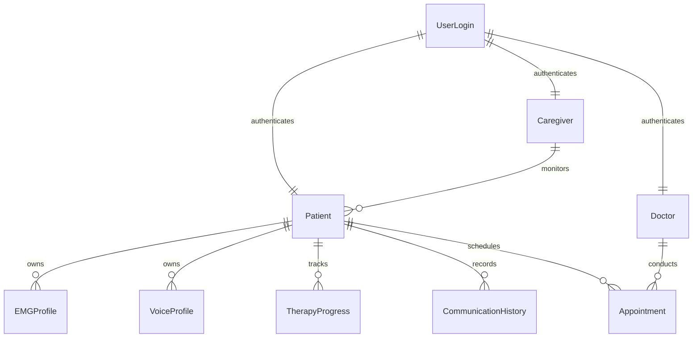

# VoiceBack – Database Schema Architecture

> **Document Version:** 2.0  
> **Status:** Fully Implemented & Operational  
> **Target Database:** MongoDB Atlas (NoSQL)  
> **ORM Layer:** Mongoose (v9.9.0)  

---

## 1. Database Implementation Status

> [!NOTE]
> **Database implementation is 100% complete and connected to MongoDB Atlas.**
> 
> All 9 Mongoose collection schemas (`UserLogin`, `Patient`, `Doctor`, `Caregiver`, `VoiceProfile`, `EMGProfile`, `TherapyProgress`, `CommunicationHistory`, `Appointment`) are fully implemented in `backend/src/models/`, integrated into Node.js Express service layers (`backend/src/services/`), and exposed via REST API controllers (`backend/src/controllers/`).

---

## 2. Implemented MongoDB Collection Architecture (9 Collections)

The database utilizes **9 MongoDB Collections** designed for clinical therapy tracking, patient management, and communication history logging:

---

## 3. Collection Specifications & Mongoose Schemas

### 1. `UserLogin` `[Implemented - backend/src/models/UserLogin.js]`
Stores authentication credentials, hashed passwords, and role access control:
- `_id`: ObjectId (Auto-generated)
- `email`: String (Required, Unique, Lowercase, Trimmed)
- `passwordHash`: String (Required, Hashed via `bcrypt` with 10 salt rounds)
- `role`: String (Enum: `Patient`, `Doctor`, `Caregiver`; Default: `Patient`)
- `lastLogin`: Date
- `createdAt` & `updatedAt`: Timestamps

> [!SECURITY]
> Password security is strictly enforced at the database service level. All query operations (`find`, `findById`, `findByIdAndUpdate`, `findByIdAndDelete`) exclude `passwordHash` by using `.select('-passwordHash')`. Passwords are plain-text inputs converted into 60-character `bcrypt` hashes before persistence.

### 2. `Patient` `[Implemented - backend/src/models/Patient.js]`
Clinical demographic profile and doctor/caregiver linkage:
- `_id`: ObjectId
- `userId`: Schema.Types.ObjectId (Ref: `UserLogin`, Required)
- `fullName`: String (Required, Trimmed)
- `age`: Number (Required, Min: 0)
- `aphasiaType`: String (Required; e.g., Broca's, Wernicke's, Global, Anomic)
- `assignedDoctorId`: Schema.Types.ObjectId (Ref: `Doctor`)
- `assignedCaregiverId`: Schema.Types.ObjectId (Ref: `Caregiver`)
- `createdAt` & `updatedAt`: Timestamps

### 3. `Doctor` `[Implemented - backend/src/models/Doctor.js]`
Medical practitioner details:
- `_id`: ObjectId
- `userId`: Schema.Types.ObjectId (Ref: `UserLogin`, Required)
- `fullName`: String (Required, Trimmed)
- `specialization`: String (Required)
- `hospitalAffiliation`: String (Required)
- `licenseNumber`: String (Required, Unique)
- `createdAt` & `updatedAt`: Timestamps

### 4. `Caregiver` `[Implemented - backend/src/models/Caregiver.js]`
Caregiver relationship tracking:
- `_id`: ObjectId
- `userId`: Schema.Types.ObjectId (Ref: `UserLogin`, Required)
- `fullName`: String (Required, Trimmed)
- `phone`: String (Required)
- `relationshipToPatient`: String (Required)
- `createdAt` & `updatedAt`: Timestamps

### 5. `VoiceProfile` `[Implemented - backend/src/models/VoiceProfile.js]`
Personalized TTS audio synthesis settings:
- `_id`: ObjectId
- `patientId`: Schema.Types.ObjectId (Ref: `Patient`, Required)
- `pitch`: Number (Default: 1.0, Range: 0.5 - 2.0)
- `speedRate`: Number (Default: 1.0, Range: 0.5 - 2.0)
- `voiceGender`: String (Enum: `Male`, `Female`, `Neutral`)
- `customVoiceAssetUrl`: String
- `createdAt` & `updatedAt`: Timestamps

### 6. `EMGProfile` `[Implemented - backend/src/models/EMGProfile.js]`
Calibrated sEMG baseline thresholds:
- `_id`: ObjectId
- `patientId`: Schema.Types.ObjectId (Ref: `Patient`, Required)
- `baselineVoltage`: Number (Required)
- `maxVoluntaryContraction`: Number (Required)
- `calibrationVector`: [Number] (Array of baseline float values)
- `calibratedAt`: Date (Default: `Date.now`)
- `createdAt` & `updatedAt`: Timestamps

### 7. `TherapyProgress` `[Implemented - backend/src/models/TherapyProgress.js]`
Clinical therapy session scores:
- `_id`: ObjectId
- `patientId`: Schema.Types.ObjectId (Ref: `Patient`, Required)
- `sessionDate`: Date (Default: `Date.now`)
- `exercisesCompleted`: Number (Required, Min: 0)
- `accuracyScore`: Number (Required, Range: 0 - 100)
- `notes`: String
- `createdAt` & `updatedAt`: Timestamps

### 8. `CommunicationHistory` `[Implemented - backend/src/models/CommunicationHistory.js]`
Real-time speech recognition event logs:
- `_id`: ObjectId
- `patientId`: Schema.Types.ObjectId (Ref: `Patient`, Required)
- `timestamp`: Date (Default: `Date.now`)
- `attemptType`: String (Enum: `Silent`, `Whispered`, `Weak`, `Unclear`, `Normal`)
- `recognizedText`: String (Required)
- `confidenceScore`: Number (Range: 0.0 - 1.0)
- `createdAt` & `updatedAt`: Timestamps

### 9. `Appointment` `[Implemented - backend/src/models/Appointment.js]`
Clinical session scheduling:
- `_id`: ObjectId
- `patientId`: Schema.Types.ObjectId (Ref: `Patient`, Required)
- `doctorId`: Schema.Types.ObjectId (Ref: `Doctor`, Required)
- `appointmentDate`: Date (Required)
- `status`: String (Enum: `Scheduled`, `Completed`, `Cancelled`; Default: `Scheduled`)
- `clinicalNotes`: String
- `createdAt` & `updatedAt`: Timestamps

---

## 4. Verification & Testing

The database implementation has been verified through:
1. **Live Connection to MongoDB Atlas**: Successfully connected via `mongoose.connect(MONGODB_URI)`.
2. **Automated Test Scripts (`backend/scripts/`)**:
   - `testModels.js`: Validates schema instantiation, validations, and field constraints.
   - `testServices.js`: Validates database CRUD operations, password hashing, and query projection.
   - `testRoutes.js`: Validates Express route routing to Mongoose services.
3. **Postman HTTP Testing**: Validated end-to-end request/response workflows for all 9 resource collections and `POST /api/user-logins/login`.

