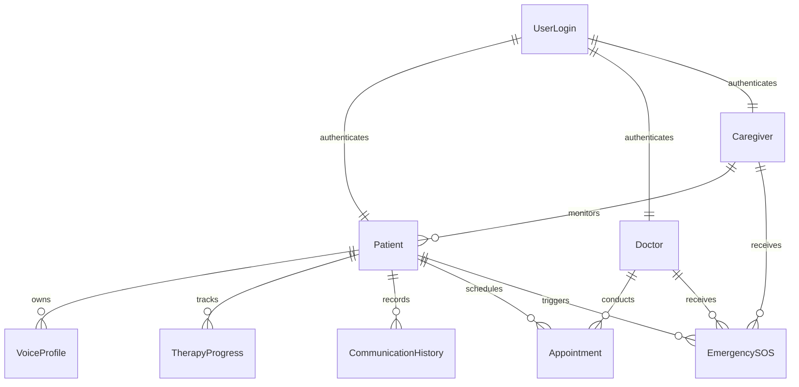

# VoiceBack – Database Schema Architecture

> **Document Version:** 2.2 (Canonical Production Schema Lock)  
> **Status:** Fully Implemented & Operational  
> **Target Database:** MongoDB Atlas (NoSQL)  
> **ORM Layer:** Mongoose (v9.9.0)  

---

## 1. Database Implementation Status

> [!NOTE]
> **Database implementation is 100% complete and connected to MongoDB Atlas.**
> 
> All **9 Mongoose collection schemas** (`UserLogin`, `Patient`, `Doctor`, `Caregiver`, `VoiceProfile`, `TherapyProgress`, `CommunicationHistory`, `Appointment`, `EmergencySOS`) are fully implemented in `backend/src/models/`, integrated into Node.js Express service layers (`backend/src/services/`), and exposed via REST API controllers (`backend/src/controllers/`).

*(Note: The legacy `EMGProfile` collection is retired from the active VoiceBack architecture).*

---

## 2. Implemented MongoDB Collection Architecture (9 Collections)

The database utilizes **9 MongoDB Collections** designed for clinical therapy tracking, patient management, voice persistence, and emergency response:

---

## 3. Collection Specifications & Mongoose Schemas

### 1. `UserLogin`
Stores authentication credentials, hashed passwords, and role access control:
- `_id`: ObjectId (Auto-generated)
- `email`: String (Required, Unique, Lowercase, Trimmed)
- `passwordHash`: String (Required, Hashed via `bcrypt` with 10 salt rounds)
- `role`: String (Enum: `Patient`, `Doctor`, `Caregiver`; Default: `Patient`)
- `lastLogin`: Date
- `createdAt` & `updatedAt`: Timestamps

> [!SECURITY]
> Password security is strictly enforced at the database service level. All query operations (`find`, `findById`, `findByIdAndUpdate`, `findByIdAndDelete`) exclude `passwordHash` by using `.select('-passwordHash')`. Passwords are plain-text inputs converted into 60-character `bcrypt` hashes before persistence.

### 2. `Patient`
Clinical demographic profile and doctor/caregiver linkage:
- `_id`: ObjectId
- `userId`: Schema.Types.ObjectId (Ref: `UserLogin`, Required)
- `fullName`: String (Required, Trimmed)
- `age`: Number (Required, Min: 0)
- `aphasiaType`: String (Required; e.g., Broca's, Wernicke's, Global, Anomic)
- `assignedDoctorId`: Schema.Types.ObjectId (Ref: `Doctor`)
- `assignedCaregiverId`: Schema.Types.ObjectId (Ref: `Caregiver`)
- `createdAt` & `updatedAt`: Timestamps

### 3. `Doctor`
Medical practitioner details:
- `_id`: ObjectId
- `userId`: Schema.Types.ObjectId (Ref: `UserLogin`, Required)
- `fullName`: String (Required, Trimmed)
- `specialization`: String (Required)
- `hospitalAffiliation`: String (Required)
- `licenseNumber`: String (Required, Unique)
- `createdAt` & `updatedAt`: Timestamps

### 4. `Caregiver`
Caregiver relationship tracking:
- `_id`: ObjectId
- `userId`: Schema.Types.ObjectId (Ref: `UserLogin`, Required)
- `fullName`: String (Required, Trimmed)
- `phone`: String (Required)
- `relationshipToPatient`: String (Required)
- `createdAt` & `updatedAt`: Timestamps

### 5. `VoiceProfile`
Personalized TTS audio synthesis settings and **Cartesia voice cloning ID**:
- `_id`: ObjectId
- `patientId`: Schema.Types.ObjectId (Ref: `Patient`, Required)
- `pitch`: Number (Default: 1.0, Range: 0.5 - 2.0)
- `speedRate`: Number (Default: 1.0, Range: 0.5 - 2.0)
- `voiceGender`: String (Enum: `Male`, `Female`, `Neutral`; Default: `Neutral`)
- `customVoiceAssetUrl`: String (Trimmed, Default: '')
- `voiceId`: String (Trimmed, Default: ''; stores patient's assigned Cartesia voice ID)
- `status`: String (Enum: `Not Configured`, `Processing`, `Ready`, `Failed`; Default: `Not Configured`)
- `lastClonedAt`: Date
- `createdAt` & `updatedAt`: Timestamps

### 6. `TherapyProgress`
Clinical therapy session scores:
- `_id`: ObjectId
- `patientId`: Schema.Types.ObjectId (Ref: `Patient`, Required)
- `sessionDate`: Date (Default: `Date.now`)
- `exercisesCompleted`: Number (Required, Min: 0)
- `accuracyScore`: Number (Required, Range: 0 - 100)
- `notes`: String
- `createdAt` & `updatedAt`: Timestamps

### 7. `CommunicationHistory`
Real-time speech recognition event logs:
- `_id`: ObjectId
- `patientId`: Schema.Types.ObjectId (Ref: `Patient`, Required)
- `timestamp`: Date (Default: `Date.now`)
- `attemptType`: String (Enum: `Silent`, `Whispered`, `Weak`, `Unclear`, `Normal`)
- `recognizedText`: String (Required)
- `confidenceScore`: Number (Range: 0.0 - 1.0)
- `createdAt` & `updatedAt`: Timestamps

### 8. `Appointment`
Clinical session scheduling:
- `_id`: ObjectId
- `patientId`: Schema.Types.ObjectId (Ref: `Patient`, Required)
- `doctorId`: Schema.Types.ObjectId (Ref: `Doctor`, Required)
- `appointmentDate`: Date (Required)
- `status`: String (Enum: `Scheduled`, `Completed`, `Cancelled`; Default: `Scheduled`)
- `clinicalNotes`: String
- `createdAt` & `updatedAt`: Timestamps

### 9. `EmergencySOS`
Patient emergency alert dispatch and logging:
- `_id`: ObjectId
- `patientId`: Schema.Types.ObjectId (Ref: `Patient`, Required)
- `caregiverId`: Schema.Types.ObjectId (Ref: `Caregiver`, Default: null)
- `doctorId`: Schema.Types.ObjectId (Ref: `Doctor`, Default: null)
- `status`: String (Enum: `Active`, `Acknowledged`, `Resolved`; Default: `Active`)
- `message`: String (Trimmed, Default: 'Emergency SOS triggered by patient')
- `location`: String (Trimmed, Default: 'Home / Primary Location')
- `triggeredAt`: Date (Default: `Date.now`)
- `createdAt` & `updatedAt`: Timestamps

---

## 4. Verification & Testing

The database implementation has been verified through:
1. **Live Connection to MongoDB Atlas**: Successfully connected via `mongoose.connect(MONGODB_URI)`.
2. **Automated Test Scripts (`backend/scripts/`)**:
   - `testModels.js`: Validates schema instantiation, validations, and field constraints across models.
   - `testServices.js`: Validates database CRUD operations, password hashing, and query projection.
   - `testRoutes.js`: Validates Express route routing to Mongoose services.
3. **Audit Compliance**: Zero fake/dummy test patients; production collection structure adheres to authoritative Mongoose models.
