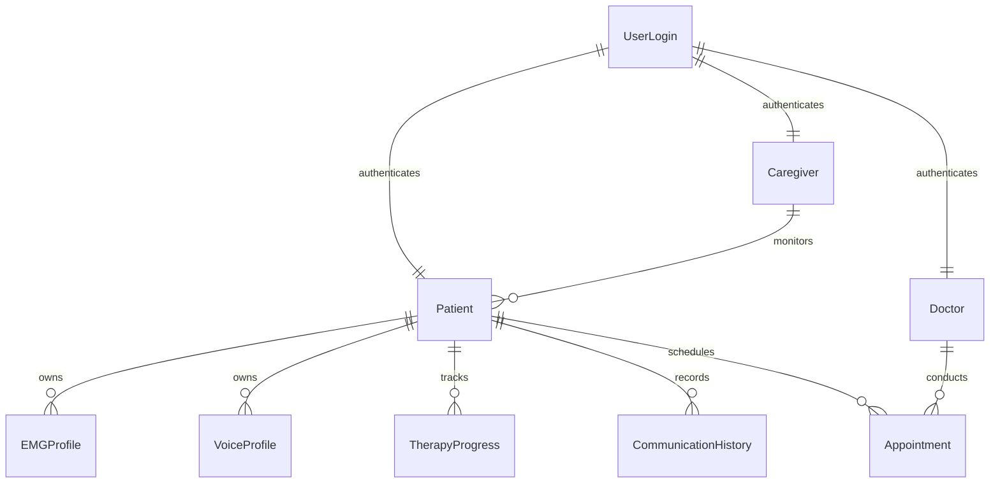

# VoiceBack – Database Schema Architecture

> **Document Version:** 1.0  
> **Status:** Planned Specification  
> **Target Database:** MongoDB Atlas (NoSQL)  

---

## 1. Database Implementation Status

> [!IMPORTANT]
> **Database implementation has not started.**
> 
> The database schemas and relationships described in this document represent the planned clinical and operational data model for Phase 4 of the VoiceBack project. Currently, all telemetry data is processed transiently over BLE.

---

## 2. Planned MongoDB Collection Architecture (9 Collections)

When implemented, the database will utilize **9 MongoDB Collections** designed for clinical therapy tracking, patient management, and communication history logging:

---

## 3. Collection Specifications

### 1. `UserLogin` `[Planned]`
Stores authentication credentials, hashed passwords, and role access control:
- `_id`: ObjectId
- `email`: String (Unique)
- `passwordHash`: String
- `role`: String (`Patient` | `Doctor` | `Caregiver`)
- `createdAt`: Date
- `lastLogin`: Date

### 2. `Patient` `[Planned]`
Clinical demographic profile and doctor/caregiver linkage:
- `_id`: ObjectId
- `userId`: Ref (`UserLogin`)
- `fullName`: String
- `age`: Number
- `aphasiaType`: String (e.g., Broca's, Wernicke's, Global)
- `assignedDoctorId`: Ref (`Doctor`)
- `assignedCaregiverId`: Ref (`Caregiver`)

### 3. `Doctor` `[Planned]`
Medical practitioner details:
- `_id`: ObjectId
- `userId`: Ref (`UserLogin`)
- `fullName`: String
- `specialization`: String
- `hospitalAffiliation`: String
- `licenseNumber`: String

### 4. `Caregiver` `[Planned]`
Caregiver relationship tracking:
- `_id`: ObjectId
- `userId`: Ref (`UserLogin`)
- `fullName`: String
- `phone`: String
- `relationshipToPatient`: String

### 5. `VoiceProfile` `[Planned]`
Personalized TTS audio synthesis settings:
- `_id`: ObjectId
- `patientId`: Ref (`Patient`)
- `pitch`: Number
- `speedRate`: Number
- `voiceGender`: String
- `customVoiceAssetUrl`: String

### 6. `EMGProfile` `[Planned]`
Calibrated sEMG baseline thresholds:
- `_id`: ObjectId
- `patientId`: Ref (`Patient`)
- `baselineVoltage`: Number
- `maxVoluntaryContraction`: Number
- `calibrationVector`: Array of Numbers
- `calibratedAt`: Date

### 7. `TherapyProgress` `[Planned]`
Clinical therapy session scores:
- `_id`: ObjectId
- `patientId`: Ref (`Patient`)
- `sessionDate`: Date
- `exercisesCompleted`: Number
- `accuracyScore`: Number
- `notes`: String

### 8. `CommunicationHistory` `[Planned]`
Real-time speech recognition event logs:
- `_id`: ObjectId
- `patientId`: Ref (`Patient`)
- `timestamp`: Date
- `attemptType`: String (`Silent` | `Whispered` | `Weak` | `Unclear`)
- `recognizedText`: String
- `confidenceScore`: Number

### 9. `Appointment` `[Planned]`
Clinical session scheduling:
- `_id`: ObjectId
- `patientId`: Ref (`Patient`)
- `doctorId`: Ref (`Doctor`)
- `appointmentDate`: Date
- `status`: String (`Scheduled` | `Completed` | `Cancelled`)
- `clinicalNotes`: String
