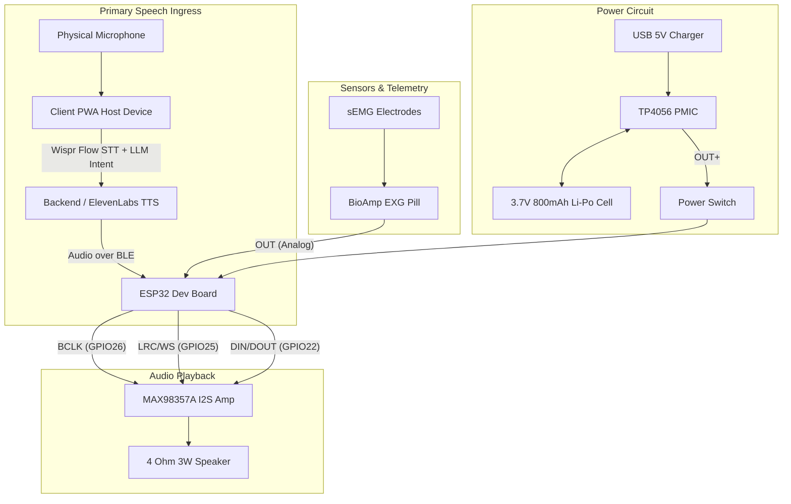

# VoiceBack – Hardware Specifications & Wiring Matrix

> **Document Version:** 1.0  
> **Status:** Active Specification  
> **Target MCU:** ESP32 Development Board (ESP-WROOM-32 / ESP32-D0WDQ6)  

---

## 1. Selected Hardware Component Breakdown

The hardware architecture relies on accessible, low-power modules integrated into a wearable prototype:

### Microcontroller: ESP32 Development Board
- **Model:** ESP-WROOM-32 (ESP32-D0WDQ6 Dual-Core Tensilica LX6).
- **Clock Speed:** 240 MHz.
- **Wireless Connectivity:** Built-in Bluetooth Low Energy (BLE 5.0 / 4.2 BR/EDR) and 802.11 b/g/n Wi-Fi.
- **Operating Logic Voltage:** 3.3V DC.
- **Analog-to-Digital Converter (ADC):** 12-bit resolution (`0 - 4095`), ADC1_CH6 mapped to GPIO34.
- **Audio Peripheral:** Hardware I2S controller (`I2S_NUM_0`).

### Telemetry Sensor: BioAmp EXG Pill (Hardware Telemetry & Calibration)
- **Type:** Surface Electromyography (sEMG) Bio-potential Sensor Module.
- **Function:** Real-time analog neck muscle voltage tracking for hardware telemetry, fatigue monitoring, and baseline calibration.
- **Scope Notice:** The BioAmp EXG Pill is **NOT** the speech-recognition mechanism. The physical microphone is the **PRIMARY** speech input.
- **Electrodes:** 3-lead surface snap electrodes (2 differential sensing electrodes placed on anterior neck muscles, 1 reference/ground electrode on bony surface).
- **Signal Output:** Analog voltage ($0.0\text{V} - 3.3\text{V}$) connected to ESP32 `GPIO34` (ADC1_CH6).

### Bluetooth Low Energy (BLE)
- **Stack:** NimBLE-Arduino (v1.4.1).
- **Role:** GATT Server (`VoiceBack-Neckband`).
- **Telemetry Protocol:** JSON format packets notified over Characteristic `beb5483e-36e1-4688-b7f5-ea07361b26a8` at 50Hz interval (20ms).
- **Audio Receive Characteristic:** `cba1483e-36e1-4688-b7f5-ea07361b26b9` (180-byte 16kHz PCM chunks).

### Speaker & Audio Subsystem
- **Audio Amplifier:** MAX98357A I2S Class-D Mono Audio Amplifier Module (3.2W output into 4Ω).
- **Gain Setting:** Wired to GND (12dB gain) or 3.3V (6dB gain).
- **Speaker:** 4Ω 3W Dynamic Mini Speaker (40mm diameter) for localized physical voice output.

### Primary Acoustic Input: Physical Microphone
- **Component:** Dynamic / Electret condenser microphone attached to the client PWA host device (smartphone/tablet/PC).
- **Role:** **PRIMARY SPEECH INPUT.** Captures patient verbal attempts, whispered sounds, and dysarthric acoustic signals directly for Wispr Flow dictation.
- **Connection Interface:** Web Audio / `navigator.mediaDevices.getUserMedia` (16kHz / 44.1kHz audio stream).

---

## 2. Hardware Wiring Overview & Pin Matrix

### Complete Hardware Pin Matrix Table (Compiled Firmware Baseline)

| Hardware Module | Module Pin Name | ESP32 GPIO Pin | Connection Type & Function |
| :--- | :--- | :--- | :--- |
| **Physical Microphone** | `MIC IN` | PWA Client Device | Primary speech input (Web Audio / Wispr Flow STT) |
| **BioAmp EXG Pill** | `OUT` | `GPIO34` | Analog input (ADC1_CH6 - Input only pin, telemetry/calibration) |
| | `VCC` | `3.3V` | System positive power supply rail |
| | `GND` | `GND` | Common system ground rail |
| **MAX98357A I2S Amp** | `BCLK` | `GPIO26` | I2S Bit Clock output |
| | `LRC` / `WS` | `GPIO25` | I2S Word Select / Left-Right Clock |
| | `DIN` / `DOUT` | `GPIO22` | I2S Serial PCM Data line |
| | `GAIN` | `GND` / `3.3V` | Hardware gain setting (GND = 12dB, 3.3V = 6dB) |
| | `VIN` | `3.3V` / `5V` | Amplifier power supply rail |
| | `GND` | `GND` | Common system ground rail |
| **TP4056 PMIC** | `BAT+` / `BAT-` | Battery Terminals | 3.7V 800mAh Li-Po Cell Terminals |
| | `OUT+` | Power Switch | Switched battery positive output |
| | `OUT-` | `GND` | System ground rail |
| **Mini Speaker** | `+` / `-` | MAX98357A Speaker OUT | Differential audio output driving 4Ω 3W Speaker |

---

## 3. Hardware Status & TODOs

- **Benchtop Wiring Verification:** Implemented & Verified in Firmware.
- **Power Consumption Measurement:** **`[TODO]`**
- **Electrode Signal CMRR Tuning:** **`[TODO]`**
- **3D Printed Neckband Enclosure:** **`[TODO]`**
- **Custom PCB Schematic & Layout:** **`[TODO]`**
