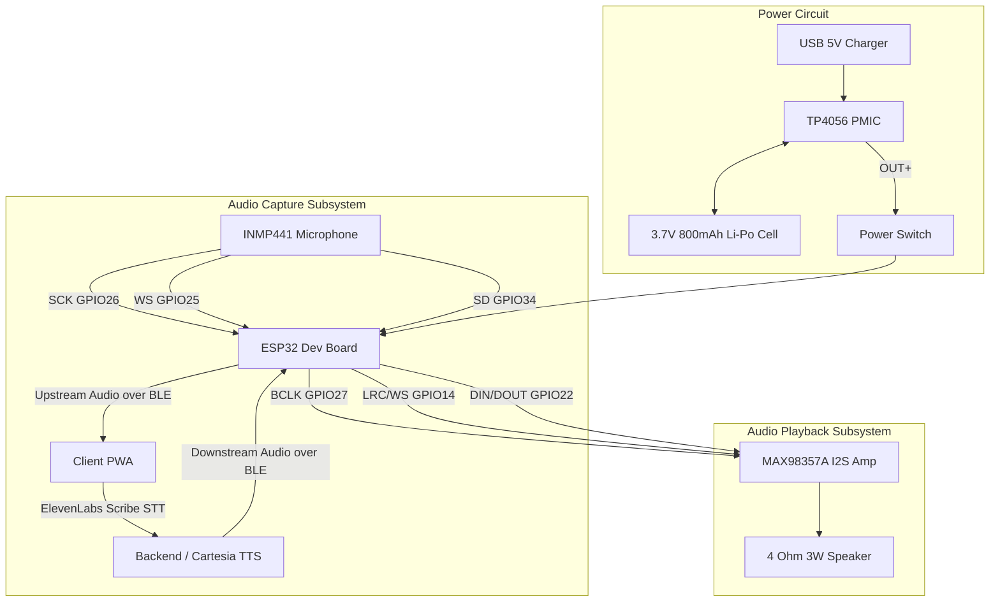

# VoiceBack – Hardware Specifications & Wiring Matrix

> **Document Version:** 2.0
> **Status:** Active Production Specification
> **Target MCU:** ESP32 Development Board (ESP-WROOM-32 / ESP32-D0WDQ6)

---

## 1. Selected Hardware Component Breakdown

The hardware architecture relies on accessible, low-power modules integrated into a wearable prototype utilizing a robust **dual-I2S** audio design.

### Microcontroller: ESP32 Development Board
- **Model:** ESP-WROOM-32 (ESP32-D0WDQ6 Dual-Core Tensilica LX6).
- **Clock Speed:** 240 MHz.
- **Wireless Connectivity:** Built-in Bluetooth Low Energy (BLE 5.0 / 4.2 BR/EDR).
- **Operating Logic Voltage:** 3.3V DC.
- **Audio Peripherals:** Two independent Hardware I2S controllers (`I2S_NUM_0` for Speaker output, `I2S_NUM_1` for Microphone input).

### Primary Acoustic Input: INMP441 Microphone (I2S_NUM_1)
- **Type:** Omnidirectional I2S MEMS Microphone.
- **Function:** **PRIMARY SPEECH INPUT.** Captures patient verbal attempts, whispered sounds, and dysarthric acoustic signals.
- **Connection Interface:** Hardware I2S (`I2S_NUM_1`).
- **Pins:**
  - `VDD  → 3.3V`
  - `GND  → GND`
  - `L/R  → GND` (Left Channel Mono)
  - `SCK  → GPIO26` (Bit Clock)
  - `WS   → GPIO25` (Word Select)
  - `SD   → GPIO34` (Serial Data In)
- **Note:** The PWA automatically switches to this microphone when the BLE neckband is connected, otherwise falling back to the browser microphone.

### Speaker & Audio Subsystem: MAX98357A (I2S_NUM_0)
- **Audio Amplifier:** MAX98357A I2S Class-D Mono Audio Amplifier Module (3.2W output into 4Ω).
- **Function:** Receives 16kHz PCM audio downstream over BLE from the Cartesia TTS engine and drives the physical speaker.
- **Connection Interface:** Hardware I2S (`I2S_NUM_0`).
- **Pins:**
  - `VIN  → 5V`
  - `GND  → GND`
  - `DIN  → GPIO22` (Serial Data Out from ESP32)
  - `BCLK → GPIO27` (Bit Clock)
  - `LRC  → GPIO14` (Left/Right Word Select)
  - `SD   → 3.3V` (SD/SD_MODE tied to 3.3V)
  - `GAIN → GND / 3.3V` (GND = 12dB, 3.3V = 6dB)
- **Speaker:** 4Ω 3W Dynamic Mini Speaker.

### Bluetooth Low Energy (BLE)
- **Stack:** NimBLE-Arduino.
- **Role:** GATT Server (`VoiceBack-Neckband`).
- **Audio Command (Speaker) Characteristic:** `cba1483e-36e1-4688-b7f5-ea07361b26b9` (Downstream Write Without Response).
- **Volume Characteristic:** `7b9e483e-36e1-4688-b7f5-ea07361b26c0` (Read / Write).
- **Microphone Control Characteristic:** `e1f2a3b4-36e1-4688-b7f5-ea07361b26e1` (Write / Write Without Response: 0x01 = Start, 0x00 = Stop).
- **Microphone Audio Characteristic:** `f3d4e5a6-36e1-4688-b7f5-ea07361b26d1` (Upstream Notify: 16kHz 16-bit Mono PCM).

> **IMPORTANT:** The BioAmp EXG Pill and sEMG telemetry have been permanently removed. They are not part of the active hardware architecture.

---

## 2. Hardware Wiring Overview & Pin Matrix

### Complete Hardware Pin Matrix Table (Compiled Firmware Baseline)

| Hardware Module | Module Pin Name | ESP32 Pin / Rail | Connection Type & Function |
| :--- | :--- | :--- | :--- |
| **INMP441 Mic** | `SCK` | `GPIO26` | I2S_NUM_1 Bit Clock |
| | `WS` | `GPIO25` | I2S_NUM_1 Word Select |
| | `SD` | `GPIO34` | I2S_NUM_1 Serial Data In |
| | `VDD` | `3.3V` | Positive power supply rail |
| | `GND` | `GND` | Common ground rail |
| | `L/R` | `GND` | Left channel mono select |
| **MAX98357A I2S Amp** | `BCLK` | `GPIO27` | I2S_NUM_0 Bit Clock output |
| | `LRC` / `WS` | `GPIO14` | I2S_NUM_0 Word Select / Left-Right Clock |
| | `DIN` / `DOUT` | `GPIO22` | I2S_NUM_0 Serial PCM Data line |
| | `GAIN` | `GND` / `3.3V` | Hardware gain setting (GND = 12dB, 3.3V = 6dB) |
| | `VIN` | `5V` | Amplifier power supply rail |
| | `GND` | `GND` | Common ground rail |
| | `SD` | `3.3V` | SD_MODE tied to 3.3V |
| **TP4056 PMIC** | `BAT+` / `BAT-` | Battery Terminals | 3.7V 800mAh Li-Po Cell Terminals |
| | `OUT+` | Power Switch | Switched battery positive output |
| | `OUT-` | `GND` | System ground rail |
| **Mini Speaker** | `+` / `-` | MAX98357A Speaker OUT | Differential audio output driving 4Ω 3W Speaker |

---

## 3. Hardware Status & Verification

- **Physical Wiring:** INMP441 (GPIO26, GPIO25, GPIO34), MAX98357A (GPIO27, GPIO14, GPIO22).
- **Firmware Compilation:** Verified & Passed via PlatformIO.
- **Audio Ingress / Egress:** Verified dual-I2S isolation.
