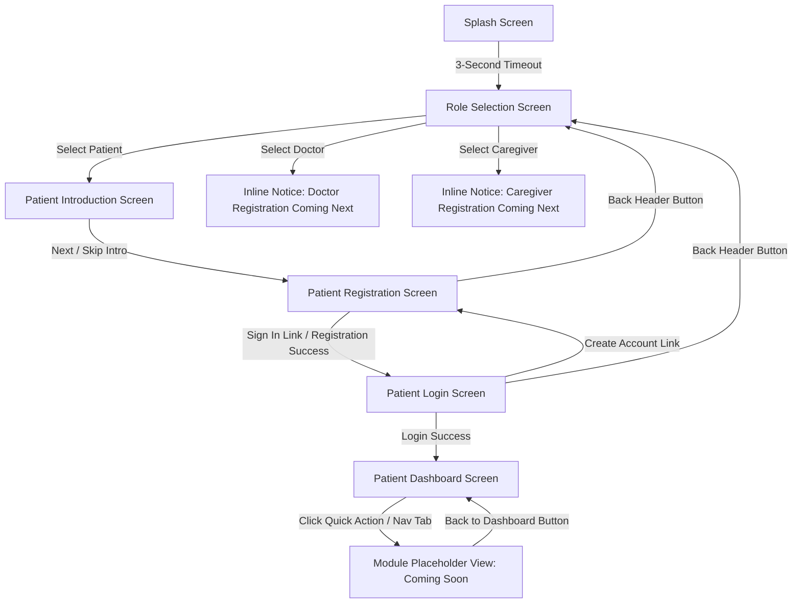

# VoiceBack Project Audit Report

**Date of Audit:** August 4, 2026  
**Project Name:** VoiceBack – Embedded AI Healthcare System for Aphasia Patients  
**Audit Scope:** Full Stack Inspection (Frontend, Backend, Database, Firmware, AI Engine, Documentation, Navigation, Auth)  
**Inspection Mode:** Read-Only Audit (No application code modified, no existing files altered or deleted)

---

## 1. PROJECT OVERVIEW

### Architecture Summary
VoiceBack is an integrated assistive healthcare wearable system designed to assist stroke and traumatic brain injury patients suffering from aphasia. The system captures surface electromyography (**sEMG**) signals from anterior neck muscles during silent, whispered, or weak speech attempts, decodes neuromuscular speech intent, and provides local and mobile speech feedback.

The ecosystem is structured around four primary layers:
1. **Hardware / Firmware Layer (`firmware/`)**: An ESP32 dev board paired with an AD620 Instrumentation Amplifier (sEMG input on GPIO34), MAX98357A I2S Class-D amplifier (audio output on GPIO4/5/6), 3W mini speaker, and TP4056 power management circuit. Firmware is built in C++ using PlatformIO and streams sEMG telemetry via NimBLE GATT Server (`VoiceBack-Neckband`).
2. **Backend API Tier (`backend/`)**: A Node.js + Express REST API configured with CORS, HTTP logging (`logger.js`), and centralized error handling middleware (`errorHandler.js`). It manages business logic across 10 controllers and 9 service modules.
3. **Database Tier (MongoDB Atlas)**: Integrated via Mongoose (v9.9.0) with 9 structured collections handling clinical data, user profiles, therapy sessions, and communication histories.
4. **Frontend Client Layer (`pwa/`)**: A React Progressive Web App built with Vite, styled with custom CSS (`index.css`), and featuring internationalization (i18n), theme toggles (Light/Dark/High Contrast), and Web Speech API fallback.

```
+-----------------------------------------------------------------------------------+
|                                 VOICEBACK ECOSYSTEM                               |
|                                                                                   |
|  [Neck Electrodes] -> [AD620 EMG] -> [ESP32 MCU] ---(Web Bluetooth)---> [React PWA]
|                                         |                            |            |
|                                    (I2S Audio)                  (REST / WSS)      |
|                                         v                            v            |
|                                   [MAX98357A Amp]       [Node.js Express API]     |
|                                         |                            |            |
|                                   [3W Speaker]             +---------+---------+  |
|                                                            |                   |  |
|                                                    [FastAPI AI Engine] [MongoDB Atlas]|
+-----------------------------------------------------------------------------------+
```

---

## 2. FOLDER STRUCTURE

Below is the complete filesystem tree of the repository. Important directories and files are explicitly annotated.

```
voiceback/
├── .gitignore
├── PROJECT_CONTEXT.md                 # Source of truth specification document
├── README.md                          # Primary repository guide & quickstart
│
├── backend/                           # Node.js + Express REST API Core
│   ├── .env.example                   # Environment variable template
│   ├── package-lock.json
│   ├── package.json                   # Express, Mongoose, bcrypt, jsonwebtoken, dotenv, cors
│   ├── README.md                      # Backend setup and endpoint documentation
│   ├── scripts/                       # Standalone automated test suite
│   │   ├── testModels.js              # Model schema instantiation tests
│   │   ├── testRoutes.js              # Express routing logic tests
│   │   └── testServices.js            # Mongoose service CRUD tests
│   └── src/                           # Backend application logic
│       ├── app.js                     # Express app setup, CORS, route mounting
│       ├── server.js                  # HTTP server entrypoint & MongoDB connection
│       ├── config/
│       │   ├── database.js            # Mongoose connection handler for MongoDB Atlas
│       │   └── index.js               # Centralized environment config loader
│       ├── controllers/               # 10 HTTP request controllers
│       │   ├── appointmentController.js
│       │   ├── caregiverController.js
│       │   ├── communicationHistoryController.js
│       │   ├── doctorController.js
│       │   ├── emgProfileController.js
│       │   ├── healthController.js
│       │   ├── patientController.js
│       │   ├── therapyProgressController.js
│       │   ├── userLoginController.js
│       │   └── voiceProfileController.js
│       ├── middleware/                # Express middleware
│       │   ├── errorHandler.js        # Global error response handler
│       │   └── logger.js              # HTTP request logger
│       ├── models/                    # 9 Mongoose data schemas
│       │   ├── Appointment.js
│       │   ├── Caregiver.js
│       │   ├── CommunicationHistory.js
│       │   ├── Doctor.js
│       │   ├── EMGProfile.js
│       │   ├── index.js               # Models central export
│       │   ├── Patient.js
│       │   ├── README.md
│       │   ├── TherapyProgress.js
│       │   ├── UserLogin.js
│       │   └── VoiceProfile.js
│       ├── routes/                    # 10 REST API route modules
│       │   ├── appointmentRoutes.js
│       │   ├── caregiverRoutes.js
│       │   ├── communicationHistoryRoutes.js
│       │   ├── doctorRoutes.js
│       │   ├── emgProfileRoutes.js
│       │   ├── healthRoutes.js
│       │   ├── index.js               # Master API router mounting /api
│       │   ├── patientRoutes.js
│       │   ├── therapyProgressRoutes.js
│       │   ├── userLoginRoutes.js
│       │   └── voiceProfileRoutes.js
│       ├── services/                  # Business logic & Mongoose queries
│       │   ├── appointmentService.js
│       │   ├── caregiverService.js
│       │   ├── communicationHistoryService.js
│       │   ├── doctorService.js
│       │   ├── emgProfileService.js
│       │   ├── index.js
│       │   ├── patientService.js
│       │   ├── README.md
│       │   ├── therapyProgressService.js
│       │   ├── userLoginService.js
│       │   └── voiceProfileService.js
│       └── utils/                     # Backend helper modules
│           ├── responseFormatter.js   # Standard JSON response wrappers
│           └── validationHelper.js    # Mongo ObjectId & email validators
│
├── docs/                              # Full Technical Documentation Suite
│   ├── AI_CONTEXT.md                  # AI System Overview
│   ├── AI_PIPELINE.md                 # Signal processing & ML specifications
│   ├── CHANGELOG.md                   # Project version history
│   ├── DATABASE.md                    # MongoDB Atlas schema specifications
│   ├── DECISIONS.md                   # Architectural Decision Records (ADRs)
│   ├── HARDWARE.md                    # Pin assignments & electrical wiring matrix
│   ├── MEETING_NOTES.md               # Confirmed meeting notes
│   ├── NEXT_STEPS.md                  # Development task roadmap
│   ├── PROJECT_HISTORY.md             # Project milestones
│   └── SOFTWARE.md                    # Firmware & API technical documentation
│
├── firmware/                          # ESP32 C++ PlatformIO Firmware
│   ├── platformio.ini                 # ESP32 config (NimBLE, ArduinoJson dependencies)
│   ├── README.md                      # PlatformIO & Arduino IDE build guide
│   ├── include/                       # Driver header files
│   │   ├── audio_driver.h             # MAX98357A I2S DAC driver header
│   │   ├── ble_service.h              # NimBLE GATT telemetry server header
│   │   ├── config.h                   # Hardware GPIO pins & Bluetooth UUIDs
│   │   └── emg_sensor.h               # AD620 ADC & EMA filter header
│   └── src/                           # Source implementations
│       ├── audio_driver.cpp           # I2S PCM audio & test sine wave generator
│       ├── ble_service.cpp            # JSON telemetry over BLE notification
│       ├── emg_sensor.cpp             # 12-bit ADC sampling & EMA filter (alpha=0.15)
│       └── main.cpp                   # 50Hz timing loop & serial log stream
│
├── pwa/                               # React Progressive Web App (Active)
│   ├── .gitignore
│   ├── .oxlintrc.json                 # Oxlint configuration
│   ├── index.html                     # HTML root container
│   ├── package-lock.json
│   ├── package.json                   # React 19, Lucide React, Vite, Oxlint
│   ├── README.md
│   ├── vite.config.js                 # Vite bundler config
│   ├── public/                        # Static assets & web icons
│   │   ├── favicon.svg
│   │   ├── icons.svg
│   │   └── voiceback-logo.png
│   └── src/                           # React frontend source code
│       ├── App.css                    # App component styles
│       ├── App.jsx                    # Core screen state machine & routing
│       ├── index.css                  # Comprehensive design system & CSS variables
│       ├── main.jsx                   # React DOM root mounting
│       ├── assets/                    # Image assets
│       │   ├── healthcare_avatar.png  # Realistic avatar guide image
│       │   ├── hero.png
│       │   ├── react.svg
│       │   ├── vite.svg
│       │   └── voiceback-logo.png
│       ├── components/                # UI Screens & Modal Components
│       │   ├── AuthFormScreen.jsx                # [UNUSED/LEGACY]
│       │   ├── AuthFormScreen.jsx                # Legacy component
│       │   ├── PatientDashboardPlaceholder.jsx   # [UNUSED/LEGACY]
│       │   ├── PatientDashboardScreen.jsx        # Patient main dashboard view
│       │   ├── PatientIntroScreen.jsx            # Animated avatar onboarding
│       │   ├── PatientLoginScreen.jsx            # Patient authentication view
│       │   ├── PatientRegistrationScreen.jsx     # Multi-field patient signup
│       │   ├── RoleSelectionScreen.jsx           # Role choice (Patient/Doctor/Caregiver)
│       │   ├── SettingsBottomSheet.jsx           # Modal settings sheet
│       │   ├── SplashScreen.jsx                  # 3-second startup screen
│       │   └── VoiceBackLogo.jsx                 # Logo renderer component
│       ├── context/
│       │   └── SettingsContext.jsx           # Settings, i18n, & Speech state
│       └── i18n/
│           └── translations.js               # English, Kannada, Hindi translations
│
└── pwa-old/                           # [DEPRECATED/LEGACY] Previous Multi-Page Structure
    ├── .env.example
    ├── package.json
    └── src/                           # Obsolete React router file tree
```

---

## 3. FRONTEND STATUS

The frontend (`pwa/`) is structured as a single-page React app managed via screen state (`splash` $\rightarrow$ `role-selection` $\rightarrow$ `patient-intro` $\rightarrow$ `patient-register` $\rightarrow$ `patient-login` $\rightarrow$ `patient-dashboard`).

| Screen / Page | Status | Navigation Path | Components Used | Bugs / Audit Findings |
| :--- | :---: | :--- | :--- | :--- |
| **Splash Screen** | **Completed** | Auto-transitions to `role-selection` after 3 seconds. | `SplashScreen.jsx`, `VoiceBackLogo.jsx`, `useSettings` | Hardcoded 3000ms timer in `SplashScreen.jsx` differs slightly from the 2500ms documented in `CHANGELOG.md`. |
| **Role Selection Screen** | **Completed (Patient)** / **Partial (Doctor/Caregiver)** | Patient $\rightarrow$ `patient-intro`. Doctor/Caregiver choices display inline notice. Settings $\rightarrow$ `SettingsBottomSheet`. | `RoleSelectionScreen.jsx`, `VoiceBackLogo.jsx`, `SettingsBottomSheet.jsx`, Lucide icons (`User`, `Stethoscope`, `Heart`, `Settings`, `ArrowRight`) | Doctor and Caregiver buttons do not navigate to any registration page; they only show inline notice text *"Doctor Registration – Coming Next"*. |
| **Patient Introduction Screen** | **Completed** | Next / Skip $\rightarrow$ `patient-register`. Settings $\rightarrow$ `SettingsBottomSheet`. | `PatientIntroScreen.jsx`, `VoiceBackLogo.jsx`, `SettingsBottomSheet.jsx`, `healthcare_avatar.png`, Lucide icons (`Settings`, `ArrowRight`, `FastForward`) | `SpeechSynthesisUtterance` automatically speaks narration on mount regardless of whether `voiceAssistant` toggle is set to OFF in settings. |
| **Patient Registration Screen** | **Completed (Mock)** | Back $\rightarrow$ `role-selection`. Sign In link $\rightarrow$ `patient-login`. Success $\rightarrow$ `patient-login`. | `PatientRegistrationScreen.jsx`, `VoiceBackLogo.jsx`, `SettingsBottomSheet.jsx`, Lucide icons (`ArrowLeft`, `Settings`, `Eye`, `EyeOff`, `CheckCircle`) | Form saves registered users exclusively to browser `localStorage` (`voiceback_registered_users`). It does NOT make HTTP requests to the backend Express API (`POST /api/patients` or `POST /api/user-logins`). |
| **Patient Login Screen** | **Completed (Mock)** | Back $\rightarrow$ `role-selection`. Create Account $\rightarrow$ `patient-register`. Success $\rightarrow$ `patient-dashboard`. | `PatientLoginScreen.jsx`, `VoiceBackLogo.jsx`, `SettingsBottomSheet.jsx`, Lucide icons (`ArrowLeft`, `Settings`, `Eye`, `EyeOff`, `Mail`, `Lock`, `AlertCircle`) | Auth check verifies credentials solely against browser `localStorage`. It does NOT communicate with backend endpoint `POST /api/user-logins/login`. |
| **Patient Dashboard Screen** | **In Progress / Shell** | Quick action cards & bottom tabs set `activeModule` state to render inline placeholder. Logout $\rightarrow$ `role-selection`. | `PatientDashboardScreen.jsx`, `VoiceBackLogo.jsx`, `SettingsBottomSheet.jsx`, Lucide icons (`Settings`, `Mic`, `Brain`, `Gamepad2`, `UserCheck`, `BarChart3`, `AlertTriangle`, `ArrowRight`, `Sparkles`, `Home`, `User`, `Activity`, `MessageSquare`, `Info`, `ArrowLeft`) | All sub-modules (*Silent Speech*, *Therapy Exercises*, *Therapy Games*, *Voice Cloning*, *Progress Reports*, *Emergency SOS*, *Start Conversation*, *Profile*) render a generic "Coming Soon" placeholder screen. Web Bluetooth telemetry is not connected. |
| **Patient Dashboard Placeholder** | **Unused / Legacy** | None (Orphaned component). | `PatientDashboardPlaceholder.jsx` | File exists in repository but is not imported or rendered anywhere in `App.jsx`. |
| **Auth Form Screen** | **Unused / Legacy** | None (Orphaned component). | `AuthFormScreen.jsx` | Legacy form component left in repository; not referenced in `App.jsx`. |
| **Doctor Login / Registration** | **Missing** | Not Implemented. | None | Screen files do not exist in active `pwa/`. |
| **Doctor Clinical Dashboard** | **Missing** | Not Implemented. | None | Screen files do not exist in active `pwa/`. |
| **Caregiver Login / Registration** | **Missing** | Not Implemented. | None | Screen files do not exist in active `pwa/`. |
| **Caregiver Dashboard** | **Missing** | Not Implemented. | None | Screen files do not exist in active `pwa/`. |
| **Therapy & Games Screen** | **Missing** | Not Implemented (Placeholder state only). | None | Screen files do not exist. |
| **Live sEMG / Silent Speech View** | **Missing** | Not Implemented (Placeholder state only). | None | Screen files do not exist. |

---

## 4. BACKEND STATUS

The backend (`backend/`) is built on Node.js and Express, connected to MongoDB Atlas via Mongoose.

| Backend Component | File / Path | Status | Verification & Functional Detail |
| :--- | :--- | :---: | :--- |
| **Database Connection** | `src/config/database.js` | **Completed** | Handles Mongoose connection lifecycle to MongoDB Atlas using `MONGODB_URI` from `.env`. |
| **Environment Loader** | `src/config/index.js` | **Completed** | Exports `port`, `env`, `mongodbUri`, `jwtSecret`, and `clientOrigin`. |
| **Express Core App** | `src/app.js`, `src/server.js` | **Completed** | Instantiates Express, configures CORS, JSON parsers, HTTP logger middleware, and mounts API router under `/api`. |
| **Error Middleware** | `src/middleware/errorHandler.js` | **Completed** | Catches unhandled errors and formats standard 500 JSON responses. |
| **Logger Middleware** | `src/middleware/logger.js` | **Completed** | Logs HTTP method, URL path, status code, and response latency. |
| **Auth Guard Middleware** | `src/middleware/authMiddleware.js` | **Missing** | **Not Implemented.** There is no JWT verification middleware to restrict API route access. All REST endpoints are currently un-authenticated. |
| **Response Utilities** | `src/utils/responseFormatter.js` | **Completed** | Provides standardized `sendSuccess`, `sendError`, `sendValidationError`, and `sendNotFound` functions. |
| **Validation Helpers** | `src/utils/validationHelper.js` | **Completed** | Utility checks for valid MongoDB `ObjectId` strings and email format regex. |
| **Health Endpoint** | `src/routes/healthRoutes.js`, `src/controllers/healthController.js` | **Completed** | `GET /api/health` returns status `"UP"`, process uptime, and ISO timestamp. |
| **User Login System** | `userLoginService.js`, `userLoginController.js`, `userLoginRoutes.js` | **Completed** | Password hashing via `bcrypt` (10 rounds), `.select('-passwordHash')` query projections, and `POST /api/user-logins/login` endpoint issuing JWT tokens valid for 7 days (`expiresIn: "7d"`). |
| **Patient System** | `patientService.js`, `patientController.js`, `patientRoutes.js` | **Completed** | Full CRUD routing (`GET`, `POST`, `PUT`, `DELETE`) with Mongoose populate for Doctor, Caregiver, EMG, and Voice profiles. |
| **Doctor System** | `doctorService.js`, `doctorController.js`, `doctorRoutes.js` | **Completed** | Full CRUD routing for medical credentials and assigned patient arrays. |
| **Caregiver System** | `caregiverService.js`, `caregiverController.js`, `caregiverRoutes.js` | **Completed** | Full CRUD routing for caregiver contact details and monitored patient lists. |
| **EMG Profile System** | `emgProfileService.js`, `emgProfileController.js`, `emgProfileRoutes.js` | **Completed** | Full CRUD routing for baseline voltage calibration metrics. |
| **Voice Profile System** | `voiceProfileService.js`, `voiceProfileController.js`, `voiceProfileRoutes.js` | **Completed** | Full CRUD routing for voice pitch, speed rate, and synthesized audio assets. |
| **Therapy Progress System**| `therapyProgressService.js`, `therapyProgressController.js`, `therapyProgressRoutes.js` | **Completed** | Full CRUD routing for session dates, exercise counts, accuracy scores, and clinical notes. |
| **Communication Log** | `communicationHistoryService.js`, `communicationHistoryController.js`, `communicationHistoryRoutes.js` | **Completed** | Full CRUD routing for speech attempt timestamps, detected signal types, decoded text, and confidence scores. |
| **Appointment System** | `appointmentService.js`, `appointmentController.js`, `appointmentRoutes.js` | **Completed** | Full CRUD routing for clinical scheduling and doctor notes. |

---

## 5. DATABASE STATUS

The system specifies **9 MongoDB Collections** managed via Mongoose models in `backend/src/models/`.

| Collection / Model Name | Schema File | Status | Fields & Structural Overview |
| :--- | :--- | :---: | :--- |
| **`UserLogin`** | `UserLogin.js` | **Completed** | `username`, `email` (unique, lowercase), `passwordHash`, `role` (`Patient` \| `Doctor` \| `Caregiver`), `isActive`, `lastLogin`, `timestamps`. |
| **`Patient`** | `Patient.js` | **Completed** | `userLoginId`, `fullName`, `age`, `gender`, `contactNumber`, `address`, `medicalHistory`, `aphasiaType`, `assignedDoctorId`, `assignedCaregiverId`, `emgProfileId`, `voiceProfileId`, `timestamps`. |
| **`Doctor`** | `Doctor.js` | **Completed** | `userLoginId`, `fullName`, `specialization`, `licenseNumber`, `contactNumber`, `email`, `hospitalAffiliation`, `assignedPatientIds` (array of Patient ObjectIds), `timestamps`. |
| **`Caregiver`** | `Caregiver.js` | **Completed** | `userLoginId`, `fullName`, `relationshipToPatient`, `contactNumber`, `email`, `assignedPatientIds` (array of Patient ObjectIds), `timestamps`. |
| **`EMGProfile`** | `EMGProfile.js` | **Completed** | `patientId`, `baselineVoltage`, `thresholdVoltage`, `peakVoltage`, `rawSamplingRate`, `smoothedSamplingRate`, `status`, `timestamps`. |
| **`VoiceProfile`** | `VoiceProfile.js` | **Completed** | `patientId`, `voiceName`, `pitch`, `speedRate`, `language`, `customModelUrl`, `isActive`, `timestamps`. |
| **`TherapyProgress`** | `TherapyProgress.js` | **Completed** | `patientId`, `sessionDate`, `totalDurationMinutes`, `exercisesCompleted`, `accuracyScore`, `clinicalNotes`, `timestamps`. |
| **`CommunicationHistory`** | `CommunicationHistory.js` | **Completed** | `patientId`, `timestamp`, `detectedSignalType`, `decodedText`, `confidenceScore`, `outputMode`, `timestamps`. |
| **`Appointment`** | `Appointment.js` | **Completed** | `patientId`, `doctorId`, `appointmentDate`, `status` (`Scheduled` \| `Completed` \| `Cancelled` \| `No-Show`), `reasonForVisit`, `clinicalNotes`, `timestamps`. |

---

## 6. FIRMWARE STATUS

The neckband wearable firmware (`firmware/`) is written in C++ for PlatformIO targeting the ESP32 development board.

| Firmware Module | Files | Status | Technical Implementation Details |
| :--- | :--- | :---: | :--- |
| **Pin & Hardware Config** | `include/config.h` | **Completed** | Configures GPIO34 for AD620 sEMG analog input, GPIO4 (BCLK), GPIO5 (LRC), GPIO6 (DOUT) for MAX98357A I2S DAC, sample rate (50Hz / 20ms), EMA smoothing coefficient ($\alpha = 0.15$), and NimBLE service/characteristic UUIDs. |
| **EMG Acquisition & Filtering** | `include/emg_sensor.h`, `src/emg_sensor.cpp` | **Completed** | Reads 12-bit raw ADC ($0-4095$) from GPIO34, applies Exponential Moving Average (EMA) filtering ($S_t = \alpha X_t + (1-\alpha) S_{t-1}$), scales voltage ($0-3.3\text{V}$), calculates MAV deviation, and executes baseline auto-calibration. |
| **BLE Telemetry Engine** | `include/ble_service.h`, `src/ble_service.cpp` | **Completed** | Initializes NimBLE GATT Server under device name `VoiceBack-Neckband`. Streams JSON telemetry packets `{ "raw": 1842, "flt": 1835.45, "vlt": 1.479 }` over BLE notify characteristic, auto-re-advertising on disconnect. |
| **I2S DAC & Audio Driver** | `include/audio_driver.h`, `src/audio_driver.cpp` | **Completed** | Initializes ESP32 I2S peripheral (`I2S_NUM_0`, 16kHz 16-bit mono PCM) for MAX98357A Class-D amplifier. Includes a 440Hz test sine-wave chime generator (300ms) and raw PCM buffer write function. |
| **Main Sampling Loop** | `src/main.cpp` | **Completed** | Implements non-blocking 50Hz / 20ms sample interval timing loop with USB CDC Serial Monitor logging (`>AD620_Raw:...,Filtered:...`). |
| **Build Configuration** | `platformio.ini` | **Completed** | PlatformIO environment config (`esp32dev`) with 240MHz CPU clock and libraries `ArduinoJson @ ^6.21.3` and `NimBLE-Arduino @ ^1.4.1`. |
| **Client Authentication Logic** | N/A | **Incomplete** | Firmware does not verify client identity or authenticate incoming Web Bluetooth connections. |
| **Live BLE Audio Streaming** | N/A | **Incomplete** | Bi-directional streaming of speech PCM audio from PWA back to ESP32 MAX98357A speaker over BLE is not implemented in C++. |

---

## 7. AI STATUS

The repository was inspected for artificial intelligence modules, model weights, and signal classification scripts.

| AI Subsystem | Target Location | Status | Current Findings |
| :--- | :--- | :---: | :--- |
| **Python Files** | Workspace Root | **Not Implemented** | **Zero Python files (`.py`) exist in the repository.** |
| **AI Engine Directory** | `ai_engine/` | **Not Implemented** | The `ai_engine/` directory referenced as planned in project documentation does not exist. |
| **Training Scripts** | N/A | **Not Implemented** | No model training scripts exist. |
| **Inference Scripts** | N/A | **Not Implemented** | No inference or prediction routines exist. |
| **Model Weight Files** | Workspace Root | **Not Implemented** | No `.pth`, `.pt`, `.onnx`, `.tflite`, or `.h5` files exist in the repository. |
| **Voice Cloning** | N/A | **Not Implemented** | No custom TTS voice training or voice synthesis engine exists. |
| **Speech Recognition** | `pwa/src/components/` | **Partial (Browser Fallback)** | PWA uses the browser's built-in Web Speech API (`SpeechSynthesisUtterance`) as a frontend fallback. No sEMG speech attempt decoder exists. |
| **Signal Processing** | `firmware/src/emg_sensor.cpp` | **Partial (Firmware Level)** | Single-stage Exponential Moving Average (EMA) smoothing ($\alpha = 0.15$) is implemented in C++ on the ESP32. Feature extraction (MAV, RMS, ZCR, WL) is not yet implemented. |

---

## 8. NAVIGATION MAP

The active React application (`pwa/src/App.jsx`) uses state-driven conditional rendering (`currentScreen`).



### Broken / Incomplete Navigation Flows Identified:
1. **Doctor Portal Flow**: Clicking "Doctor" on Role Selection Screen sets `roleNotice` to *"Doctor Registration – Coming Next"*. Navigation halts; no registration or login screen exists.
2. **Caregiver Portal Flow**: Clicking "Caregiver" on Role Selection Screen sets `roleNotice` to *"Caregiver Registration – Coming Next"*. Navigation halts; no registration or login screen exists.
3. **Login / Registration Back Button**: Clicking the header back button (`ArrowLeft`) on Patient Registration or Patient Login returns directly to `role-selection`, bypassing `patient-intro`.
4. **Dashboard Modules**: Clicking any quick action card (*Silent Speech*, *Therapy Exercises*, *Therapy Games*, *Voice Cloning*, *Progress Reports*, *Emergency SOS*, *Start Conversation*) or bottom navigation tab (*Games*, *Therapy*, *Reports*, *Profile*) switches state to `activeModule`, which displays a generic inline placeholder ("Coming Soon").

---

## 9. AUTHENTICATION

### Current Login Implementation (Frontend)
- Located in `pwa/src/components/PatientLoginScreen.jsx`.
- When the user submits the form, it checks credentials against array `voiceback_registered_users` and object `voiceback_current_user` stored in browser `localStorage`.
- It does **not** send an HTTP request to the backend service.

### Current Registration Implementation (Frontend)
- Located in `pwa/src/components/PatientRegistrationScreen.jsx`.
- Upon submitting valid inputs (Full Name, Age, Gender, Mobile, Email, Password, Confirm Password, Aphasia Type, Language), the user object is appended to `voiceback_registered_users` in browser `localStorage`.
- It does **not** send an HTTP request to the backend service.

### Backend Authentication Architecture
- Located in `backend/src/services/userLoginService.js` and `backend/src/controllers/userLoginController.js`.
- User creation automatically hashes passwords using `bcrypt` with 10 salt rounds.
- Endpoint `POST /api/user-logins/login` validates credentials against MongoDB `UserLogin` collection and returns a signed JSON Web Token (`jsonwebtoken`) valid for 7 days (`expiresIn: "7d"`).

### Authentication Gap / Disconnect Summary
1. **Mock Authentication Active**: The frontend PWA runs entirely on mock authentication using browser `localStorage`.
2. **Backend Auth Disconnected**: The working backend Express login and password hashing pipeline is completely disconnected from the React frontend.
3. **Unprotected API Routes**: The backend lacks JWT authentication middleware (`authMiddleware.js`). Any client can perform `GET`, `POST`, `PUT`, or `DELETE` operations on MongoDB models without presenting a valid JWT bearer token.

---

## 10. PLACEHOLDER DETECTION

Every hardcoded value, dummy data instance, temporary component, and mock element identified in the repository is listed below:

1. **`pwa/src/components/PatientDashboardScreen.jsx`**:
   - Lines 30 & 39: Hardcoded default patient first name `'Srividya'` used if `localStorage` returns null.
   - Lines 62–100: Quick Action items (*Silent Speech*, *Therapy Exercises*, *Therapy Games*, *Voice Cloning*, *Progress Reports*, *Emergency SOS*) map to static hardcoded strings that route to a generic placeholder card.
   - Lines 256–280: "Therapy Status" card displays static hardcoded empty-state strings ("• No therapy data available. • No reports available. Complete your first therapy session to begin.").
2. **`pwa/src/components/PatientDashboardPlaceholder.jsx`**:
   - Entire 46-line file is a temporary placeholder component containing static markup ("Recovery & Therapy Module Coming Soon").
3. **`pwa/src/components/AuthFormScreen.jsx`**:
   - Entire 161-line file is an unused temporary auth component.
4. **`pwa-old/` Directory**:
   - Entire folder tree contains legacy placeholder files, including empty page directories (`pwa-old/src/pages/CaregiverAuth`, `DoctorAuth`, `PatientAuth`, `Intro`, `RoleSelection`, `Splash`).
5. **Documentation (`README.md` & `PROJECT_CONTEXT.md`)**:
   - Architecture diagrams and tables list `ai_engine/` (FastAPI Python sEMG Speech Classification Engine) as an active backend component, whereas it does not exist in the code tree.

---

## 11. BUGS & CODE DEFECTS

### 1. Build / Compile Issues
- **Missing `node_modules` in `pwa/`**: Executing `npm run build` inside `pwa/` fails with `'vite' is not recognized as an internal or external command`. Dependencies must be installed via `npm install` prior to building.

### 2. Runtime Issues
- **`PatientIntroScreen.jsx` Unconditional Speech**: `SpeechSynthesisUtterance` automatically triggers text-to-speech audio on component mount regardless of whether the user turned OFF `voiceAssistant` in Accessibility Settings.

### 3. Navigation Issues
- **Doctor / Caregiver Dead Ends**: Selecting Doctor or Caregiver on Role Selection Screen shows an inline notice text and halts navigation.
- **Login / Registration Back Button**: Back button on Patient Registration and Patient Login bypasses Patient Intro and goes straight to Role Selection.
- **Dashboard Modules Non-functional**: Clicking quick action buttons or bottom nav tabs in Patient Dashboard sets local state `activeModule` to render an inline "Coming Soon" card rather than actual features.

### 4. Security & API Enforcement Deficiencies
- **Unprotected REST Routes**: Backend Express API routes under `/api` do not check for JWT bearer tokens. Anyone can read, update, or delete clinical records without authentication.
- **Disconnected Auth Flow**: PWA registration and login store credentials in browser `localStorage` instead of dispatching requests to `POST /api/user-logins/login` or `POST /api/patients`.

### 5. Unused Files & Dead Code
- `pwa/src/components/PatientDashboardPlaceholder.jsx`: Unused component file.
- `pwa/src/components/AuthFormScreen.jsx`: Unused component file.
- `pwa-old/`: Entire deprecated directory structure left over from an earlier multi-page architecture.

---

## 12. COMPLETED FEATURES

The following checklist represents fully implemented, functional features verified in the codebase:

- [x] **ESP32 sEMG ADC Signal Acquisition** (12-bit resolution on GPIO34)
- [x] **Firmware Signal Filtering** (Exponential Moving Average smoothing, $\alpha = 0.15$)
- [x] **NimBLE Telemetry GATT Server** (Device `VoiceBack-Neckband` streaming JSON telemetry packets)
- [x] **I2S Audio DAC Driver** (MAX98357A 16kHz 16-bit mono PCM initialization with 440Hz test chime)
- [x] **Express REST API Application** (CORS, Express JSON, HTTP logging, global error handling)
- [x] **MongoDB Atlas Integration** (Mongoose connection lifecycle and environment config)
- [x] **9 Mongoose Schemas** (`UserLogin`, `Patient`, `Doctor`, `Caregiver`, `EMGProfile`, `VoiceProfile`, `TherapyProgress`, `CommunicationHistory`, `Appointment`)
- [x] **9 Business Service Modules & 10 REST Controllers**
- [x] **User Password Security** (`bcrypt` hashing with 10 salt rounds and `.select('-passwordHash')` protection)
- [x] **JWT Token Generation** (`POST /api/user-logins/login` returning 7-day signed JWT)
- [x] **Automated Backend Test Scripts** (`testModels.js`, `testRoutes.js`, `testServices.js`)
- [x] **React PWA Core UI Framework** (Vite + React 19 single-page architecture)
- [x] **Design System & Theme Engine** (CSS variables supporting Light, Dark, and High Contrast themes)
- [x] **Multi-Language i18n System** (English, Kannada, Hindi translations)
- [x] **Accessibility Controls** (Voice assistance toggle, larger text, high contrast)
- [x] **Splash Screen** (VoiceBack logo animation with auto-transition)
- [x] **Role Selection UI** (Interactive selection cards with audio assistance)
- [x] **Patient Onboarding Introduction** (Animated healthcare professional avatar)
- [x] **Patient Registration Form** (Multi-field validation for name, age, gender, mobile, email, password, aphasia type, language)
- [x] **Patient Login Form** (Password visibility toggle, remember me option, forgot password alert)
- [x] **Patient Dashboard UI Shell** (Greeting header, hero banner, quick actions grid, bottom nav bar)

---

## 13. REMAINING FEATURES

The following checklist represents features required for full system operation that are currently pending development:

- [ ] **Frontend ↔ Backend Integration** (Connect PWA Login & Registration to Express REST API endpoints)
- [ ] **JWT Authorization Middleware** (Protect Express `/api` routes with token verification)
- [ ] **Web Bluetooth API Integration** (Connect PWA to ESP32 BLE GATT server to receive live sEMG data)
- [ ] **Live sEMG Signal Visualization** (Render real-time sEMG waveform canvas in PWA)
- [ ] **AI Classifier Engine (`ai_engine/`)** (FastAPI Python backend with scikit-learn / PyTorch classifier)
- [ ] **sEMG Signal Feature Extraction** (Compute MAV, RMS, ZCR, and WL metrics on sliding windows)
- [ ] **Doctor Portal Pages** (Registration, Login, Patient List, EMG Profile Review)
- [ ] **Caregiver Portal Pages** (Registration, Login, Patient Status Tracking, Emergency Notifications)
- [ ] **Speech Therapy & Rehabilitation Module** (Interactive speech exercises and gamified rehabilitation)
- [ ] **Silent Speech Intent Classifier** (Decode sEMG signals into text and spoken audio)
- [ ] **Personalized Voice Cloning Engine** (Synthesize audio matching patient's original voice)
- [ ] **Progress Analytics & Clinical Reports** (Visual charts tracking accuracy and session history)
- [ ] **Emergency SOS Notification System** (Alert doctors/caregivers on patient trigger)
- [ ] **Bi-directional BLE Audio Streaming** (Stream synthesized PCM audio from app to ESP32 speaker)
- [ ] **Codebase Cleanup** (Remove deprecated `pwa-old/`, `PatientDashboardPlaceholder.jsx`, and `AuthFormScreen.jsx`)

---

## 14. DEVELOPMENT PROGRESS

The table below provides empirical completion estimates based strictly on verified workspace code versus project requirements:

| Subsystem / Layer | Weight | Completion % | Status Summary |
| :--- | :---: | :---: | :--- |
| **Frontend (`pwa/`)** | 25% | **45%** | Patient UI flow is built; Doctor/Caregiver flows are missing; Dashboard modules are placeholders; API and BLE integration missing. |
| **Backend (`backend/`)** | 25% | **85%** | All 9 models, services, controllers, and routes created; database connected; login & JWT token generation working; JWT auth middleware missing. |
| **Database Tier** | 15% | **90%** | All 9 Mongoose schemas defined and verified on MongoDB Atlas; indexes and query optimization remaining. |
| **Firmware (`firmware/`)** | 20% | **80%** | ADC sampling, EMA filtering, NimBLE GATT streaming, and I2S DAC driver functional; bi-directional audio streaming and client auth missing. |
| **AI Engine (`ai_engine/`)** | 15% | **0%** | Not Implemented. No Python files, training scripts, or inference models exist in repository. |
| **OVERALL PROJECT** | **100%** | **50.5%** | Core firmware, database, and backend infrastructure are complete; frontend UI shell is built; integration across hardware, AI, frontend, and backend is pending. |

---

## 15. NEXT RECOMMENDED TASKS

The top 10 development tasks recommended in strict priority order to advance the VoiceBack system:

1. **Install Frontend Dependencies & Verify Build**  
   Run `npm install` inside `pwa/` to install Vite and dependencies, ensuring `npm run build` completes without errors.

2. **Implement Backend JWT Authentication Middleware**  
   Create `backend/src/middleware/authMiddleware.js` to verify JWT bearer tokens in incoming request headers and secure all REST routes under `/api`.

3. **Connect PWA Authentication to Backend REST API**  
   Replace `localStorage` mock logic in `PatientRegistrationScreen.jsx` and `PatientLoginScreen.jsx` with active `fetch()` / `axios` API calls targeting `POST /api/user-logins` and `POST /api/user-logins/login`.

4. **Build Web Bluetooth BLE Telemetry Client in PWA**  
   Create `pwa/src/services/bleService.js` using the browser Web Bluetooth API to scan, pair, and subscribe to notifications from `VoiceBack-Neckband` (Service `19B10000-E8F2-537E-4F6C-D104768A1214`).

5. **Implement Live sEMG Waveform Visualizer**  
   Develop an HTML5 Canvas / Recharts component in PWA to plot incoming raw, filtered, and voltage sEMG telemetry in real time.

6. **Initialize FastAPI Python AI Engine (`ai_engine/`)**  
   Create `ai_engine/` directory with Python requirements (`fastapi`, `uvicorn`, `numpy`, `scipy`, `scikit-learn`), implementing feature extraction (MAV, RMS, ZCR, WL) and a preliminary speech attempt classifier.

7. **Develop Doctor Portal Screens**  
   Build Doctor Registration, Doctor Login, and Doctor Clinical Dashboard screens in `pwa/src/components/` with API integration to fetch assigned patient records.

8. **Develop Caregiver Portal Screens**  
   Build Caregiver Registration, Caregiver Login, and Patient Monitoring screens in `pwa/src/components/` with real-time status updates.

9. **Build Speech Therapy & Rehabilitation Module**  
   Develop interactive speech practice views and integrate them with the `TherapyProgress` MongoDB collection.

10. **Clean Up Obsolete Code & Legacy Directories**  
    Remove deprecated `pwa-old/` directory and unused component files (`PatientDashboardPlaceholder.jsx`, `AuthFormScreen.jsx`) to maintain repository parity.
